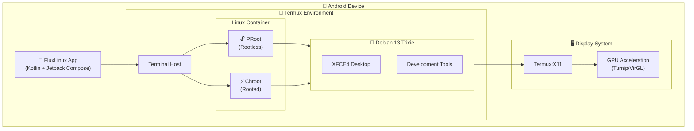

  
  <h1>FluxLinux</h1>
  
<strong>Run full Linux desktop environments on your Android device</strong>

---

---

## 📱 Screenshots

  <table>
    <tr>
      <td align="center"> <b>Home</b></td>
      <td align="center"> <b>Distros</b></td>
      <td align="center"> <b>Install</b></td>
    </tr>
    <tr>
      <td align="center"> <b>Settings</b></td>
      <td align="center"> <b>Desktop</b></td>
      <td align="center"> <b>Terminal</b></td>
    </tr>
  </table>

---

## 🚀 Vision

Modern Android hardware is powerful enough to run desktop workloads, but the software ecosystem limits it. **FluxLinux** bridges this gap, enabling:

- 🌐 **Full-Stack Web Development** — Node.js, Python, React, VS Code
- 🎮 **Desktop Gaming** — Box64/Wine *(coming soon)*
- 🔐 **Cybersecurity** — Nmap, Wireshark, Metasploit
- 📊 **Data Science** — Jupyter, TensorFlow, PyTorch
- 🎨 **Creative Tools** — GIMP, Blender, Inkscape
- 📄 **Productivity** — LibreOffice, Firefox Desktop

---

## ✨ Key Features

| Feature | Description |
|---------|-------------|
| 🐧 **One-Tap Install** | Install Debian with XFCE4 desktop in minutes |
| 🔓 **Rootless Mode** | Works on any Android 8+ device via PRoot |
| ⚡ **Turbo Mode** | Native chroot performance for rooted devices |
| 🎮 **GPU Acceleration** | Turnip (Adreno) + VirGL for graphics |
| 🎨 **Custom Themes** | Beautiful XFCE4 with Space theme |
| 📦 **Dev Stacks** | Pre-configured environments for coding |

---

## 🖼️ Desktop Experience

  
  
<em>Full XFCE4 desktop with hardware acceleration</em>

### 🚀 Development in Action

<table>
<tr>
<td align="center"> <b>Flutter Development</b></td>
<td align="center"> <b>React Web App</b></td>
</tr>
<tr>
<td align="center"> <b>Jupyter + TensorFlow</b></td>
<td align="center"> <b>Kotlin/Gradle Build</b></td>
</tr>
<tr>
<td align="center"> <b>GIMP Image Editor</b></td>
<td align="center"> <b>LibreOffice Writer</b></td>
</tr>
<tr>
<td align="center" colspan="2"> <b>Pitivi Video Editor</b></td>
</tr>
</table>

### Included Development Stacks

  <table>
    <tr>
      <td align="center">🌐 <b>Web Dev</b> Node.js, React, VS Code</td>
      <td align="center">📱 <b>App Dev</b> Flutter, Kotlin, Android SDK</td>
      <td align="center">🧬 <b>Data Science</b> Jupyter, TensorFlow</td>
    </tr>
    <tr>
      <td align="center">🎮 <b>Game Dev</b> Godot Engine</td>
      <td align="center">🔐 <b>Security</b> Kali Tools</td>
      <td align="center">🎨 <b>Graphics</b> GIMP, Blender</td>
    </tr>
  </table>

---

## 🛠 Architecture

---

## 📚 Documentation

| Document | Description |
|----------|-------------|
| [**Installation Reference**](docs/install_ref/) | Packages, paths, versions, environments |
| [**Scripts Reference**](docs/scripts_reference.md) | All installation and setup scripts |
| [**Hardware Acceleration**](docs/hardware_acceleration.md) | GPU setup guide (Turnip/VirGL) |
| [**Script Execution Workflow**](docs/script_execution_workflow.md) | How scripts are executed |
| [**Testing Reference**](docs/testing_reference.md) | Sample projects for testing |
| [**Assets Reference**](docs/assets_reference.md) | Themes, icons, wallpapers |
| [**Architecture**](docs/architecture.md) | System design overview |
| [**Roadmap**](docs/roadmap.md) | Development roadmap |

---

## 📦 Installation

### Requirements

- Android 8.0+ (API 26+)
- [Termux](https://f-droid.org/packages/com.termux/) (from F-Droid)
- [Termux:X11](https://github.com/termux/termux-x11) (for GUI)

### Install

1. Download FluxLinux from [Releases](https://github.com/abhay-byte/fluxlinux/releases)
2. Install Termux from F-Droid
3. Install Termux:X11
4. Open FluxLinux and follow setup wizard

  
  
<em>Easy setup wizard</em>

---

## 🎮 GPU Acceleration

FluxLinux supports hardware-accelerated graphics:

<table>
<tr>
<td width="50%">

| GPU Type | Driver | Performance |
|----------|--------|-------------|
| Adreno (Qualcomm) | Turnip + Zink | 🟢 Excellent |
| Mali (ARM) | VirGL | 🟡 Good |
| Mali/PowerVR (MediaTek) | VirGL | 🟡 Good |
| Other | VirGL | 🟡 Good |

📖 [Hardware Acceleration Guide](docs/hardware_acceleration.md)

</td>
<td width="50%" align="center">

 <em>GPU Driver Selection</em>

</td>
</tr>
</table>

---

## 🤝 Contributing

Contributions are welcome! Please check the [Roadmap](docs/roadmap.md) to see active development phases.

1. Fork the repository
2. Create your feature branch (`git checkout -b feature/AmazingFeature`)
3. Commit your changes (`git commit -m 'Add some AmazingFeature'`)
4. Push to the branch (`git push origin feature/AmazingFeature`)
5. Open a Pull Request

---

## 📄 License

This project is licensed under the **GNU General Public License v3.0 (GPLv3)**.

See [LICENSE](LICENSE) for details.

---

  
Made with ❤️ by <a href="https://github.com/abhay-byte">Abhay Raj</a>

  

    <a href="https://github.com/abhay-byte/fluxlinux">GitHub</a> •
    <a href="https://github.com/abhay-byte/fluxlinux/issues">Issues</a> •
    <a href="docs/">Documentation</a>
  

