

  
  <h1>NativeCode</h1>
  
<strong>A vibe coding workspace for Android with AI coding tools, desktop editors, and MCP integrations</strong>

---

<em>Current package and store identifiers may still use <code>fluxlinux</code> while the public rebrand to NativeCode rolls out.</em>

---

## 📱 Screenshots

  <table>
    <tr>
      <td align="center">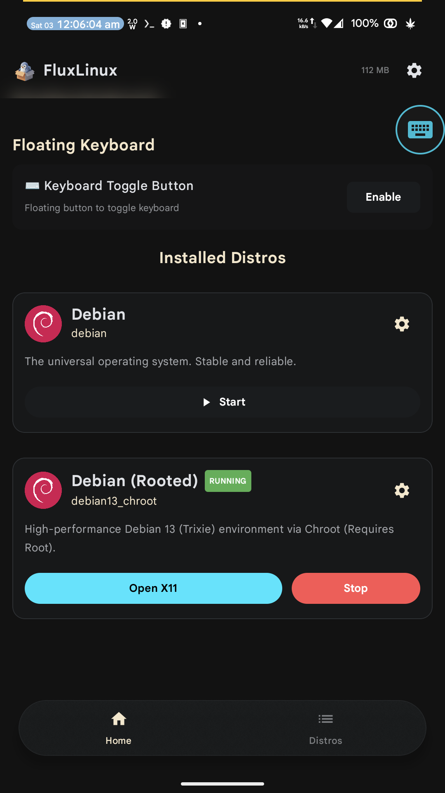 <b>Home</b></td>
      <td align="center">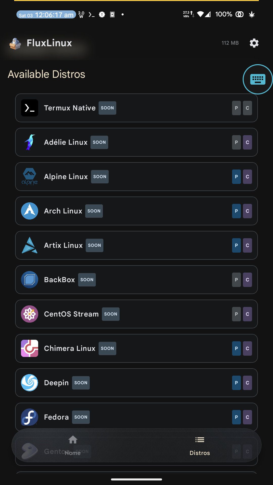 <b>Distros</b></td>
      <td align="center">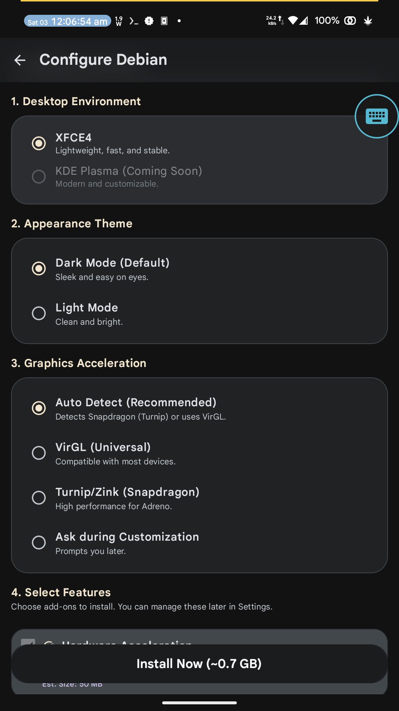 <b>Install</b></td>
    </tr>
    <tr>
      <td align="center">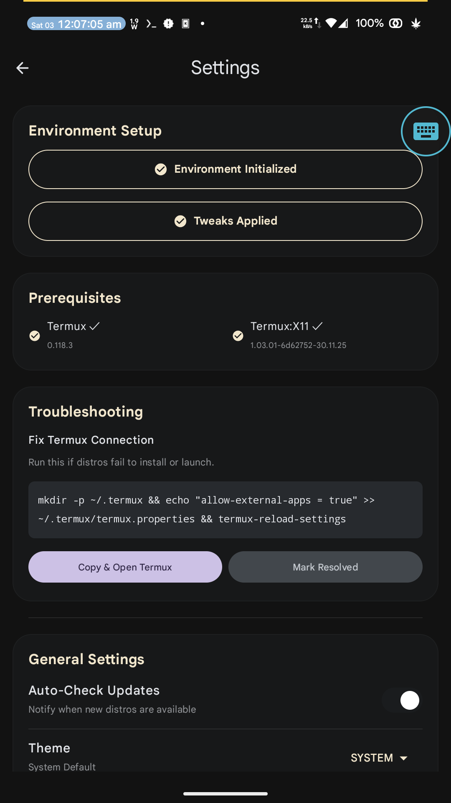 <b>Settings</b></td>
      <td align="center">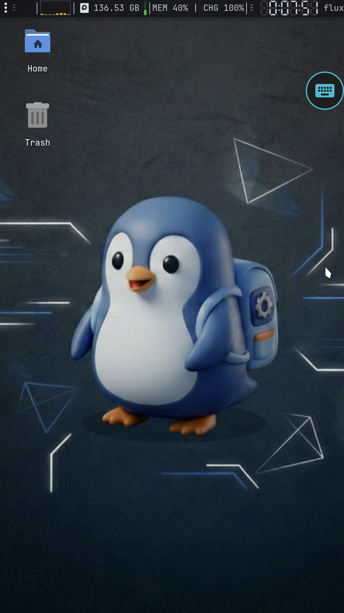 <b>Desktop</b></td>
      <td align="center">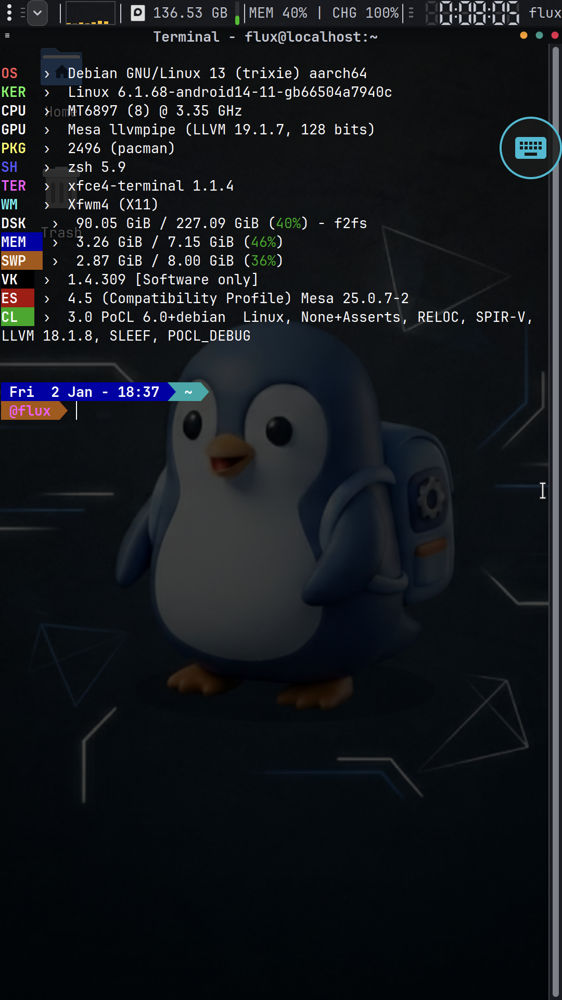 <b>Terminal</b></td>
    </tr>
  </table>

---

## 🚀 Vision

Modern Android hardware is already capable enough for serious development work. **NativeCode** reframes that capability around vibe coding: a portable Android workspace where agentic CLI tools, desktop IDEs, language servers, and MCP-powered assistants can live in one place.

- 🤖 **AI Coding CLIs** - Codex, Claude Code, Gemini CLI, aider, KiloCode CLI, Kiro CLI, QwenCode, OpenCode, Cline, Junie, and similar terminal-first tools
- 💻 **Desktop Editors and IDEs** - Antigravity, Codex App, VS Code, Cursor, Windsurf, Trae, Kiro IDE, and browser-based workspaces
- 🔌 **MCP and LSP Integrations** - Caveman, Context7, context-mode, filesystem, android-mcp, kotlin-mcp, playwright-mcp, github-mcp, Speckit, Agency Agent, and related local tooling
- 📱 **Android-Centric Development** - Kotlin, Gradle, Android SDK workflows, adb-driven automation, web previews, and mobile-first testing
- 🐧 **Portable Linux Runtime** - Rootless by default, faster rooted paths when available, with the same Linux-on-Android foundation already documented in this repo

---

## ✨ Key Features

| Feature | Description |
|---------|-------------|
| 🤖 **CLI Agent Hub** | Run terminal-native coding tools like Codex, Claude Code, Gemini CLI, aider, QwenCode, OpenCode, Cline, and Junie |
| 💻 **Editor Optionality** | Use VS Code, Cursor, Windsurf, Trae, Kiro IDE, Codex App, Antigravity, or browser-based IDE workflows |
| 🔌 **MCP + LSP Ready** | Connect Context7, context-mode, filesystem, android-mcp, kotlin-mcp, github-mcp, playwright-mcp, Speckit, and agency-style agents |
| 📱 **Android Dev Friendly** | Keep Android SDK, Kotlin/Gradle, terminal automation, and mobile testing close to the device you are building on |
| 🔓 **Rootless by Default** | Works on Android 8+ via PRoot, with faster rooted paths when available |
| 🎮 **Desktop-Class Runtime** | Termux:X11, Linux packages, browsers, and GPU acceleration provide a practical foundation for long coding sessions |

---

## 🖼️ Coding Workspace

  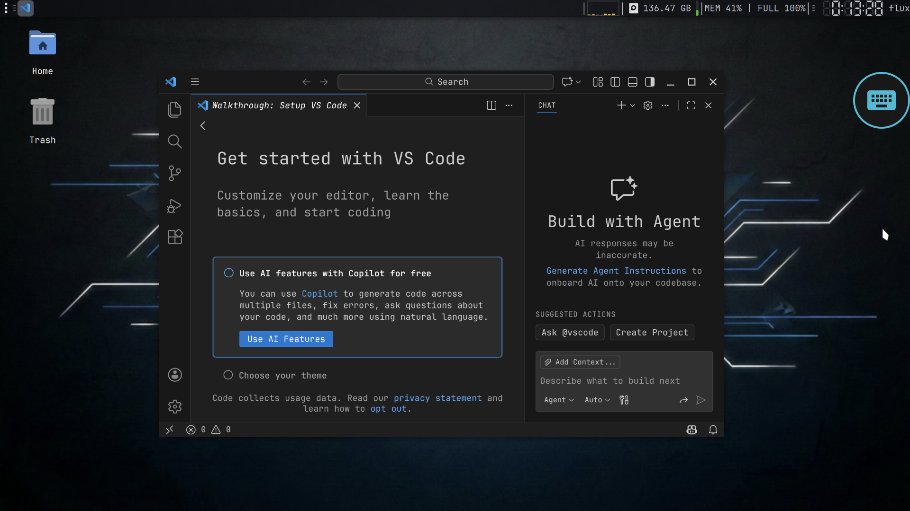
  
<em>A portable Android workstation for terminal agents, editors, browsers, and local tooling</em>

### 🚀 Development in Action

<table>
<tr>
<td align="center">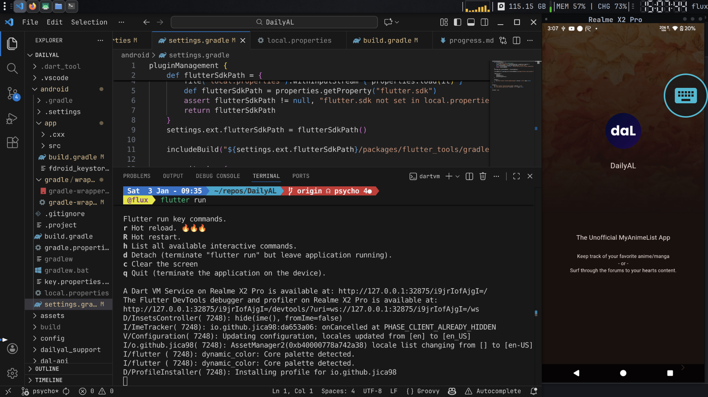 <b>Flutter Development</b></td>
<td align="center">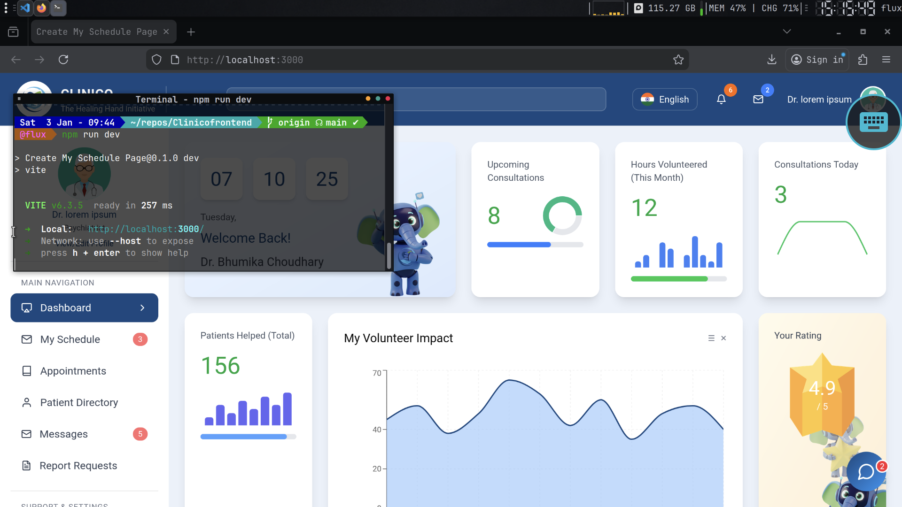 <b>React Web App</b></td>
</tr>
<tr>
<td align="center">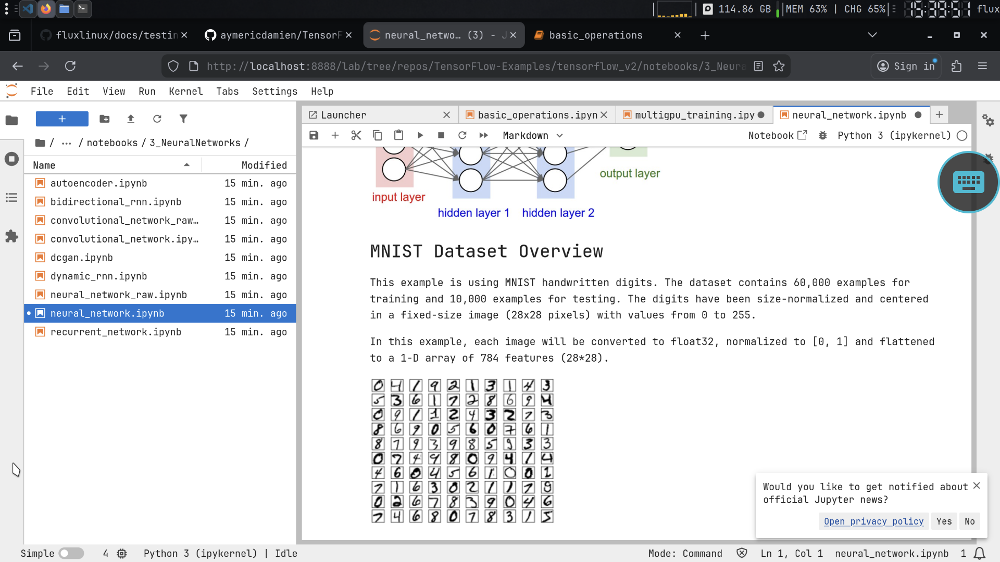 <b>Jupyter + TensorFlow</b></td>
<td align="center">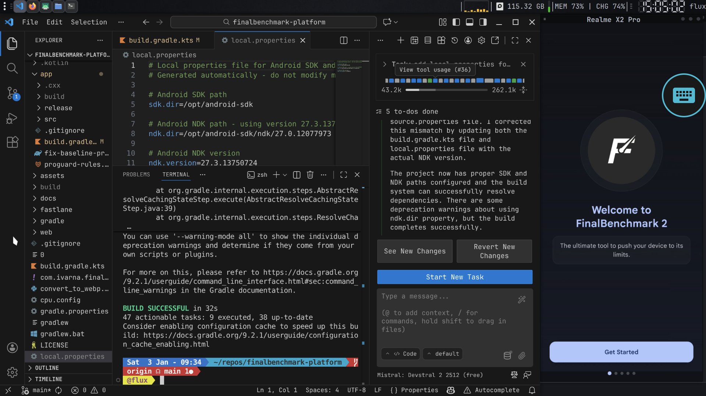 <b>Kotlin/Gradle Build</b></td>
</tr>
<tr>
<td align="center">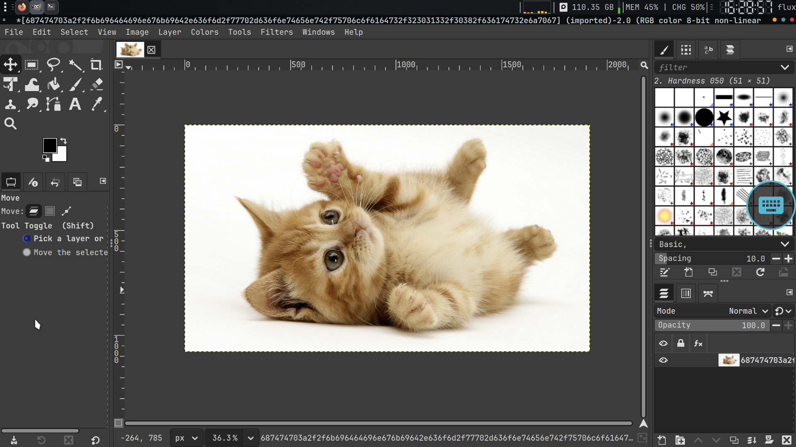 <b>GIMP Image Editor</b></td>
<td align="center">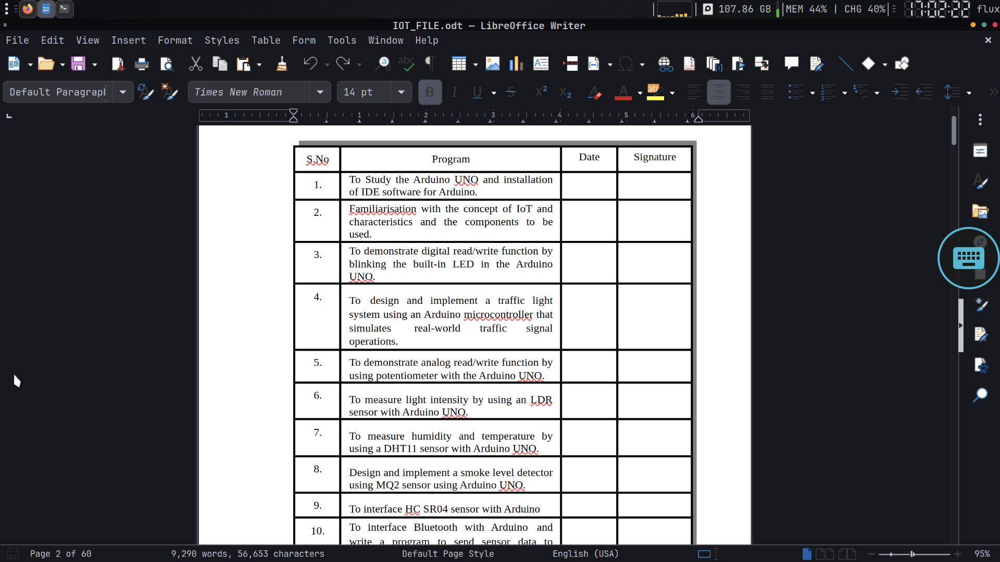 <b>LibreOffice Writer</b></td>
</tr>
<tr>
<td align="center" colspan="2">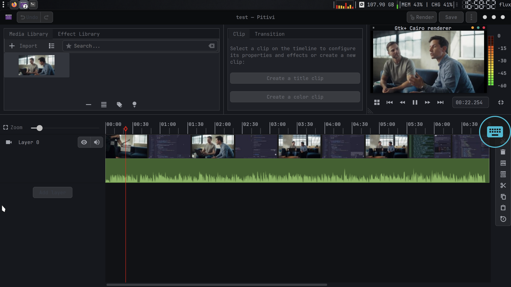 <b>Pitivi Video Editor</b></td>
</tr>
</table>

### Planned Tooling Surface

  <table>
    <tr>
      <td align="center">🤖 <b>CLI Tools</b> Codex, aider, Claude Code, Gemini CLI, QwenCode</td>
      <td align="center">💻 <b>IDEs</b> VS Code, Cursor, Windsurf, Trae, Kiro IDE</td>
      <td align="center">🔌 <b>MCP</b> Context7, context-mode, filesystem, github-mcp</td>
    </tr>
    <tr>
      <td align="center">📱 <b>Android Dev</b> Kotlin, Gradle, Android SDK, adb</td>
      <td align="center">🧠 <b>Language Servers</b> Kotlin LSP, TypeScript, Python, Rust, Go</td>
      <td align="center">⚙️ <b>Automation</b> Playwright MCP, Speckit, Agency Agent, GitHub flows</td>
    </tr>
  </table>

---

## 🛠 Architecture

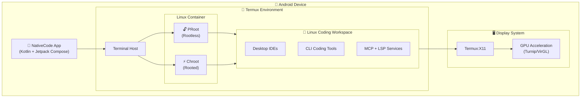

---

## 📚 Documentation

The docs under [`docs/`](docs/) are intentionally left as-is for now. They still describe the current Linux runtime, scripts, and installation internals that NativeCode builds on today.

| Document | Description |
|----------|-------------|
| [**Installation Reference**](docs/install_ref/) | Packages, paths, versions, environments |
| [**Scripts Reference**](docs/scripts_reference.md) | All installation and setup scripts |
| [**Hardware Acceleration**](docs/hardware_acceleration.md) | GPU setup guide (Turnip/VirGL) |
| [**Script Execution Workflow**](docs/script_execution_workflow.md) | How scripts are executed |
| [**Testing Reference**](docs/testing_reference.md) | Sample projects for testing |
| [**Assets Reference**](docs/assets_reference.md) | Themes, icons, wallpapers |
| [**Architecture**](docs/architecture.md) | System design overview |
| [**Roadmap**](docs/roadmap.md) | Development roadmap |

---

## 📦 Installation

### Requirements

- Android 8.0+ (API 26+)
- [Termux](https://f-droid.org/packages/com.termux/) (from F-Droid)
- [Termux:X11](https://github.com/termux/termux-x11) (for GUI)

### Install

1. Download NativeCode from [Releases](https://github.com/abhay-byte/nativecode/releases)
2. Install Termux from F-Droid
3. Install Termux:X11
4. Open NativeCode and follow setup wizard

> Note: until the package rename lands, some package IDs, store listings, and app links may still reference `fluxlinux`.

  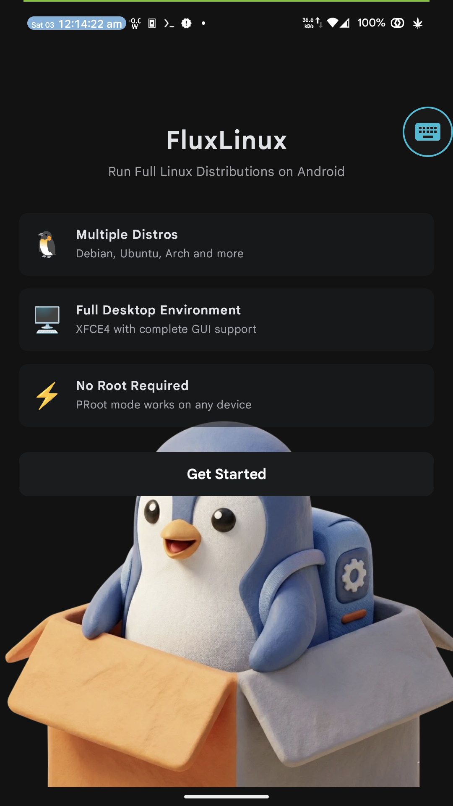
  
<em>Easy setup wizard</em>

---

## 🎮 Runtime Foundation

NativeCode currently builds on the same Linux-on-Android runtime foundation, including hardware-accelerated graphics for desktop editors, browsers, previews, and GUI tooling:

<table>
<tr>
<td width="50%">

| GPU Type | Driver | Performance |
|----------|--------|-------------|
| Adreno (Qualcomm) | Turnip + Zink | 🟢 Excellent |
| Mali (ARM) | VirGL | 🟡 Good |
| Mali/PowerVR (MediaTek) | VirGL | 🟡 Good |
| Other | VirGL | 🟡 Good |

📖 [Hardware Acceleration Guide](docs/hardware_acceleration.md)

</td>
<td width="50%" align="center">

 <em>GPU driver selection for the underlying Android Linux workspace</em>

</td>
</tr>
</table>

---

## 🤝 Contributing

Contributions are welcome! Please check the [Roadmap](docs/roadmap.md) to see active development phases.

1. Fork the repository
2. Create your feature branch (`git checkout -b feature/AmazingFeature`)
3. Commit your changes (`git commit -m 'Add some AmazingFeature'`)
4. Push to the branch (`git push origin feature/AmazingFeature`)
5. Open a Pull Request

---

## 📄 License

This project is licensed under the **GNU General Public License v3.0 (GPLv3)**.

See [LICENSE](LICENSE) for details.

---

  
Made with ❤️ by <a href="https://github.com/abhay-byte">Abhay Raj</a>

  

    <a href="https://github.com/abhay-byte/nativecode">GitHub</a> •
    <a href="https://github.com/abhay-byte/nativecode/issues">Issues</a> •
    <a href="docs/">Documentation</a>
  

