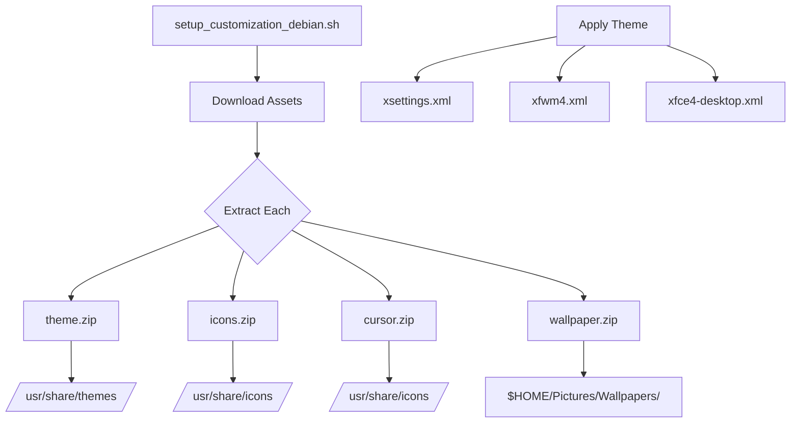

# NativeCode Assets Reference

This document provides a comprehensive overview of all assets used in the NativeCode project for distro customization, branding, and theming.

---

## Table of Contents

- [Directory Structure](#directory-structure)
- [Logo Assets](#logo-assets)
- [Onboarding Assets](#onboarding-assets)
- [Rootfs Archives](#rootfs-archives)
- [Wallpapers](#wallpapers)
- [XFCE4 Theming Assets](#xfce4-theming-assets)
  - [Themes](#themes)
  - [Icons](#icons)
  - [Cursors](#cursors)
- [Screenshots](#screenshots)
- [GitHub Release Assets](#github-release-assets)

---

## Directory Structure

```
assets/
├── logo/                    # Application logo files
│   ├── logo.png             # High-res PNG (~525 KB)
│   └── logo.webp            # Optimized WebP (~80 KB)
├── me.png                   # Developer avatar
├── onboarding/              # Onboarding screen images
│   └── onboarding-1.webp    # First onboarding slide
├── rootfs/                  # Pre-built root filesystems
│   └── debian_13_rootfs.tar.xz  # Debian 13 Trixie rootfs (85 MB)
├── screenshots/             # App screenshots
│   └── hardware_acceleration/
│       ├── 1.png            # GPU selection
│       └── 2.png            # glmark2 running
├── wallpaper/               # Desktop wallpapers
│   ├── dark.png             # Dark theme wallpaper
│   ├── dark2.png            # Alternative dark wallpaper
│   ├── light.png            # Light theme wallpaper
│   └── wallpaper.zip        # Bundled for release
└── xfce4/                   # XFCE4 customization
    ├── cursor/              # Cursor themes
    ├── icons/               # Icon packs
    └── theme/               # GTK/XFWM themes
```

---

## Logo Assets

**Location:** `assets/logo/`

| File | Size | Format | Usage |
|------|------|--------|-------|
| `logo.png` | ~525 KB | PNG | High-resolution, marketing materials |
| `logo.webp` | ~80 KB | WebP | Optimized, app usage |

The NativeCode logo is used throughout the app and promotional materials.

---

## Onboarding Assets

**Location:** `assets/onboarding/`

| File | Size | Description |
|------|------|-------------|
| `onboarding-1.webp` | 73 KB | Welcome/introduction slide |

These images are displayed during the first-run onboarding experience.

---

## Rootfs Archives

**Location:** `assets/rootfs/`

Pre-built root filesystem archives for distro installation.

| File | Size | Architecture | Description |
|------|------|--------------|-------------|
| `debian_13_rootfs.tar.xz` | 85 MB | ARM64 | Debian 13 (Trixie) base system |

### Debian 13 Rootfs Contents

The Debian 13 rootfs is a minimal base system containing:
- Core system utilities
- apt package manager
- Networking tools
- Basic shell environment

**Used by:** `setup_debian13_chroot.sh`

**Download URL (GitHub Release):**
```
https://github.com/abhay-byte/fluxlinux/releases/download/debian-v1/debian_arm64_rootfs.tar.xz
```

---

## Wallpapers

**Location:** `assets/wallpaper/`

Desktop wallpapers for the NativeCode-themed desktop environment.

| File | Size | Theme | Resolution |
|------|------|-------|------------|
| `dark.png` | 3.0 MB | Dark | High-res |
| `dark2.png` | 4.1 MB | Dark (Alt) | High-res |
| `light.png` | 3.9 MB | Light | High-res |
| `wallpaper.zip` | 6.9 MB | Bundle | All variants |

### Theme Mapping

| Theme Selection | Wallpaper File |
|-----------------|----------------|
| Dark Mode | `fluxlinux-dark.png` |
| Light Mode | `fluxlinux-light.png` |

**Used by:** `setup_customization_debian.sh`

**Download URL (GitHub Release):**
```
https://github.com/abhay-byte/fluxlinux/releases/download/debian-v1/wallpaper.zip
```

---

## XFCE4 Theming Assets

**Location:** `assets/xfce4/`

Complete theming package for XFCE4 desktop customization.

### Themes

**Location:** `assets/xfce4/theme/`

| File | Size | Theme Name | Style |
|------|------|------------|-------|
| `Space-transparency.tar.xz` | 3.4 MB | Space Transparency | Dark, transparent |
| `Space-light.tar.xz` | 2.1 MB | Space Light | Light, clean |
| `theme.zip` | 5.5 MB | Bundle | Both themes |

**Theme Details:**

| Theme | GTK Theme | XFWM Theme | Best For |
|-------|-----------|------------|----------|
| Space-transparency | Dark | Glass effects | Dark mode users |
| Space-light | Light | Clean borders | Light mode users |

**Download URL (GitHub Release):**
```
https://github.com/abhay-byte/fluxlinux/releases/download/debian-v1/theme.zip
```

---

### Icons

**Location:** `assets/xfce4/icons/`

| File | Size | Icon Theme | Description |
|------|------|------------|-------------|
| `papirus-icon-theme-20250501.tar.gz` | 32.3 MB | Papirus | Modern flat icons |

**Papirus Variants Used:**

| Theme Mode | Icon Variant |
|------------|--------------|
| Dark | Papirus-Dark |
| Light | Papirus |

**Features:**
- 50+ application categories
- Multiple sizes (16px to 64px)
- Symbolic icons for panels
- High DPI support

**Download URL (GitHub Release):**
```
https://github.com/abhay-byte/fluxlinux/releases/download/debian-v1/icons.zip
```

---

### Cursors

**Location:** `assets/xfce4/cursor/`

| File | Size | Cursor Theme | Style |
|------|------|--------------|-------|
| `01-Vimix-cursors.tar.xz` | 190 KB | Vimix | Dark cursor |
| `02-Vimix-white-cursors.tar.xz` | 190 KB | Vimix White | White cursor |
| `cursor.zip` | 380 KB | Bundle | Both variants |

**Theme Mapping:**

| Theme Mode | Cursor Theme | Reason |
|------------|--------------|--------|
| Dark | Vimix-white-cursors | Better visibility on dark backgrounds |
| Light | Vimix-cursors | Better contrast on light backgrounds |

**Download URL (GitHub Release):**
```
https://github.com/abhay-byte/fluxlinux/releases/download/debian-v1/cursor.zip
```

---

## Screenshots

**Location:** `assets/screenshots/`

Screenshots used in documentation and promotional materials.

### Hardware Acceleration

| File | Size | Description |
|------|------|-------------|
| `1.png` | 1.9 MB | GPU selection menu |
| `2.png` | 1.8 MB | glmark2 benchmark running |

---

## GitHub Release Assets

All theming assets are bundled and hosted on GitHub Releases for download during installation.

**Release Tag:** `debian-v1`

**Base URL:** `https://github.com/abhay-byte/fluxlinux/releases/download/debian-v1/`

### Asset List

| Asset | Filename | Size | Description |
|-------|----------|------|-------------|
| Themes | `theme.zip` | 5.5 MB | GTK + XFWM themes |
| Icons | `icons.zip` | ~32 MB | Papirus icon pack |
| Cursors | `cursor.zip` | 380 KB | Vimix cursor themes |
| Wallpapers | `wallpaper.zip` | 6.9 MB | Desktop backgrounds |
| Rootfs | `debian_arm64_rootfs.tar.xz` | 85 MB | Debian 13 base system |

### Download Script Example

```bash
# Download all theming assets
BASE_URL="https://github.com/abhay-byte/fluxlinux/releases/download/debian-v1"

wget -O theme.zip "$BASE_URL/theme.zip"
wget -O icons.zip "$BASE_URL/icons.zip"
wget -O cursor.zip "$BASE_URL/cursor.zip"
wget -O wallpaper.zip "$BASE_URL/wallpaper.zip"
```

---

## Asset Installation Flow



---

## License

All assets are subject to the NativeCode project license (GPLv3).

Third-party assets retain their original licenses:
- **Papirus Icons:** GPLv3
- **Vimix Cursors:** GPLv3
- **Space Theme:** GPLv3

---

## See Also

- [Scripts Reference](scripts_reference.md) - Installation scripts documentation
- [Hardware Acceleration](hardware_acceleration.md) - GPU setup guide
- [Script Execution Workflow](script_execution_workflow.md) - How assets are deployed
