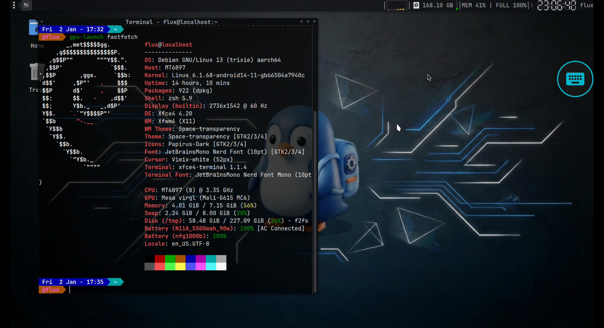
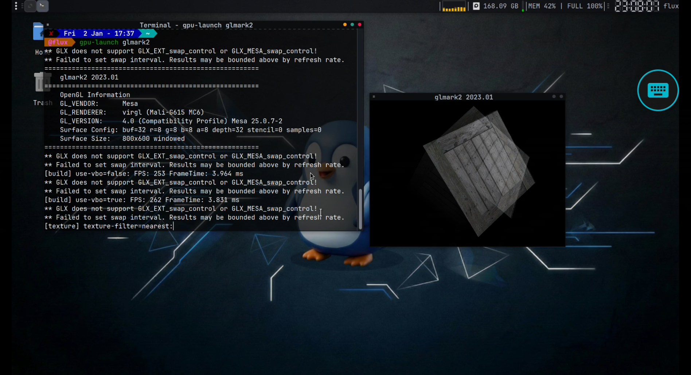
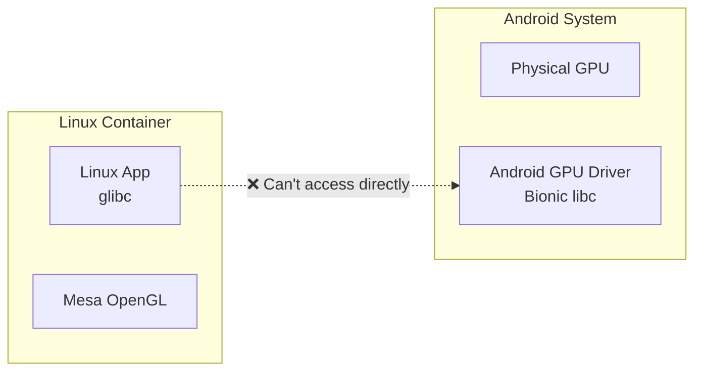
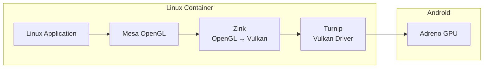
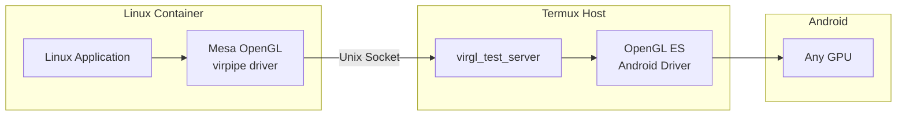

# Hardware Acceleration with gpu-launch

This guide explains how FluxLinux enables hardware-accelerated graphics in Android Linux containers and how to use the `gpu-launch` wrapper to run GPU-accelerated applications.

---

## Table of Contents

- [Overview](#overview)
- [How Hardware Acceleration Works](#how-hardware-acceleration-works)
  - [The Challenge](#the-challenge)
  - [FluxLinux Solution](#fluxlinux-solution)
- [GPU Modes](#gpu-modes)
  - [Turnip (Adreno GPUs)](#turnip-adreno-gpus)
  - [VirGL (Universal)](#virgl-universal)
- [gpu-launch Wrapper](#gpu-launch-wrapper)
  - [What It Does](#what-it-does)
  - [Environment Variables](#environment-variables)
- [Usage Examples](#usage-examples)
- [Setup Instructions](#setup-instructions)
- [Troubleshooting](#troubleshooting)
- [Performance Comparison](#performance-comparison)

---

## Overview

Hardware acceleration allows Linux applications running inside PRoot/Chroot containers to use your Android device's GPU for rendering graphics, instead of slow software rendering. This is essential for:

- 🎮 Gaming (native Linux games, emulators)
- 🎨 Graphics applications (GIMP, Blender, Inkscape)
- 🖥️ Desktop environments (smoother animations)
- 📊 3D visualization and CAD software

Without hardware acceleration, all graphics are rendered on the CPU, resulting in:
- ❌ Extremely slow performance (5-10 FPS)
- ❌ High CPU usage and heat
- ❌ Poor user experience

With hardware acceleration:
- ✅ Smooth 30-60 FPS
- ✅ Lower CPU usage
- ✅ Responsive desktop experience

### Screenshots





---

## How Hardware Acceleration Works

### The Challenge

Android devices don't natively expose OpenGL ES drivers to Linux containers. The GPU drivers are compiled for Android's Bionic libc, not glibc used by Debian/Ubuntu.



### FluxLinux Solution

FluxLinux bridges this gap using two methods:

#### Method 1: Turnip + Zink (Adreno GPUs)



**How it works:**
1. **Turnip** is a reverse-engineered Vulkan driver for Adreno GPUs
2. **Zink** translates OpenGL calls to Vulkan
3. The combination runs entirely in userspace, no kernel drivers needed

#### Method 2: VirGL (Universal)



**How it works:**
1. **virgl_test_server** runs in Termux (has access to Android GPU)
2. Linux apps connect via Unix socket
3. OpenGL commands are serialized, sent to server, executed on real GPU
4. Works with ANY GPU (Adreno, Mali, PowerVR, etc.)

---

## GPU Modes

### Turnip (Adreno GPUs)

**Best for:** Snapdragon devices with Adreno GPUs

| Pros | Cons |
|------|------|
| ✅ Highest performance | ❌ Adreno-only |
| ✅ No background server needed | ❌ Requires specific driver version |
| ✅ Direct GPU access | ❌ Some apps may have issues |
| ✅ Lower latency | |

**Supported Devices:**
- Snapdragon 845 and newer (recommended)
- Snapdragon 835 (limited support)
- Adreno 540, 615, 618, 620, 630, 640, 650, 660, 730, 740+

**Installed Components:**
- Custom Mesa with Turnip driver
- Zink (OpenGL-on-Vulkan layer)
- Vulkan ICD loader configuration

### VirGL (Universal)

**Best for:** All devices, especially non-Adreno GPUs

| Pros | Cons |
|------|------|
| ✅ Works with ALL GPUs | ❌ Requires VirGL server running |
| ✅ High compatibility | ❌ Slightly higher latency |
| ✅ Mali, PowerVR, Intel support | ❌ Overhead from serialization |
| ✅ Fallback option | |

**Supported Devices:**
- All Android devices with GPU
- Mali (Exynos, MediaTek)
- PowerVR (older MediaTek)
- Intel (x86 tablets)
- Adreno (as fallback)

**Required Components:**
- `virgl_test_server_android` (in Termux)
- Mesa virpipe driver (in container)

---

## gpu-launch Wrapper

### What It Does

The `gpu-launch` script is a wrapper that:

1. **Detects** the configured GPU mode (Turnip or VirGL)
2. **Sets** required environment variables
3. **Executes** your application with proper GPU context

### Location

```bash
/usr/local/bin/gpu-launch
```

### Source Code

```bash
#!/bin/bash
# FluxLinux GPU Launcher
# Automatically detects and applies the correct GPU configuration

MODE="turnip"  # or "virgl" - set during setup

# Reset environment
unset GALLIUM_DRIVER
unset MESA_LOADER_DRIVER_OVERRIDE
unset VK_ICD_FILENAMES

if [ "$MODE" = "turnip" ]; then
    # Turnip (Adreno Vulkan) + Zink
    export MESA_LOADER_DRIVER_OVERRIDE=zink
    export VK_ICD_FILENAMES=/usr/share/vulkan/icd.d/freedreno_icd.aarch64.json
    export TU_DEBUG=noconform
    export MESA_GL_VERSION_OVERRIDE=4.6
    export MESA_GLES_VERSION_OVERRIDE=3.2
    export MESA_NO_ERROR=1

elif [ "$MODE" = "virgl" ]; then
    # VirGL (Universal - works with all GPUs)
    export GALLIUM_DRIVER=virpipe
    export MESA_GL_VERSION_OVERRIDE=4.0
    export MESA_GLES_VERSION_OVERRIDE=3.1
    export MESA_NO_ERROR=1
    export VTEST_SOCKET_NAME=${VTEST_SOCKET_NAME:-/tmp/.virgl_test}
fi

# Execute Application
exec "$@"
```

### Environment Variables

#### Turnip Mode

| Variable | Value | Purpose |
|----------|-------|---------|
| `MESA_LOADER_DRIVER_OVERRIDE` | `zink` | Force Zink (OpenGL→Vulkan) |
| `VK_ICD_FILENAMES` | `/usr/share/vulkan/icd.d/freedreno_icd.aarch64.json` | Turnip Vulkan driver |
| `TU_DEBUG` | `noconform` | Disable conformance checks (performance) |
| `MESA_VK_WSI_DEBUG` | `sw` | Force software WSI (required for PRoot) |
| `MESA_GL_VERSION_OVERRIDE` | `4.6` | Report OpenGL 4.6 support |
| `MESA_GLES_VERSION_OVERRIDE` | `3.2` | Report OpenGL ES 3.2 support |
| `MESA_NO_ERROR` | `1` | Disable error checking (performance) |

#### VirGL Mode

| Variable | Value | Purpose |
|----------|-------|---------|
| `GALLIUM_DRIVER` | `virpipe` | Use VirGL pipe driver |
| `MESA_GL_VERSION_OVERRIDE` | `4.0` | Report OpenGL 4.0 support |
| `MESA_GLES_VERSION_OVERRIDE` | `3.1` | Report OpenGL ES 3.1 support |
| `MESA_NO_ERROR` | `1` | Disable error checking |
| `VTEST_SOCKET_NAME` | `/tmp/.virgl_test` | VirGL server socket path |

---

## Usage Examples

### Basic Usage

```bash
# Run any application with GPU acceleration
gpu-launch <application> [arguments]
```

### Testing GPU Acceleration

```bash
# Check OpenGL renderer
gpu-launch glxinfo | grep "OpenGL renderer"

# Expected output for Turnip:
# OpenGL renderer string: Turnip Adreno (TM) 650

# Expected output for VirGL:
# OpenGL renderer string: virgl
```

### Benchmarking

```bash
# Run glmark2 benchmark
gpu-launch glmark2

# Run glmark2 in windowed mode
gpu-launch glmark2 --run-forever --size 800x600

# Run with specific test
gpu-launch glmark2 --benchmark texture
```

### Running Applications

```bash
# Launch Blender with GPU
gpu-launch blender

# Launch GIMP with GPU
gpu-launch gimp

# Launch a game
gpu-launch supertuxkart

# Launch Steam (Proton games)
gpu-launch steam
```

### Debug Mode

```bash
# Enable debug output for VirGL
FLUX_GPU_DEBUG=1 gpu-launch glxinfo

# Output includes:
# [DEBUG] GALLIUM_DRIVER=virpipe
# [DEBUG] VTEST_SOCKET_NAME=/tmp/.virgl_test
# [DEBUG] XDG_RUNTIME_DIR=/tmp
# [DEBUG] VirGL socket exists
```

### Running Without Wrapper

You can also set variables manually:

```bash
# Turnip mode
MESA_LOADER_DRIVER_OVERRIDE=zink \
VK_ICD_FILENAMES=/usr/share/vulkan/icd.d/freedreno_icd.aarch64.json \
TU_DEBUG=noconform \
glmark2

# VirGL mode
GALLIUM_DRIVER=virpipe \
VTEST_SOCKET_NAME=/tmp/.virgl_test \
glmark2
```

---

## Setup Instructions

### Automatic Setup (Recommended)

Hardware acceleration is configured during distro installation if you select a GPU mode. You can also run it manually:

1. **Start GUI** (from FluxLinux app)
2. **Open Terminal** in the desktop
3. **Run as root:**
   ```bash
   sudo bash /path/to/setup_hw_accel_debian.sh
   ```
4. **Select GPU mode** when prompted
5. **Test** with `gpu-launch glmark2`

### Manual Setup

#### For Turnip (Adreno)

```bash
# 1. Install dependencies
sudo apt update
sudo apt install -y mesa-utils libgl1-mesa-dri vulkan-tools

# 2. Download Turnip drivers
TURNIP_VERSION="25.3.2"
curl -L -o /tmp/turnip.zip \
  "https://github.com/sabamdarif/termux-desktop/releases/download/turnip-${TURNIP_VERSION}/turnip-${TURNIP_VERSION}-aarch64.zip"

# 3. Install
sudo unzip -o /tmp/turnip.zip -d /usr
rm /tmp/turnip.zip

# 4. Create wrapper (see gpu-launch source above)
sudo nano /usr/local/bin/gpu-launch
# Set MODE="turnip"
sudo chmod +x /usr/local/bin/gpu-launch
```

#### For VirGL

```bash
# 1. In Termux - Install VirGL server
pkg install virglrenderer-android

# 2. Start server (automatically done by start_gui.sh)
nohup setsid virgl_test_server_android >/dev/null 2>&1 &

# 3. In Debian - Install dependencies
sudo apt update
sudo apt install -y mesa-utils libgl1-mesa-dri

# 4. Create wrapper (see gpu-launch source above)
sudo nano /usr/local/bin/gpu-launch
# Set MODE="virgl"
sudo chmod +x /usr/local/bin/gpu-launch
```

---

## Troubleshooting

### Common Issues

#### "OpenGL renderer string: llvmpipe" (Software Rendering)

**Problem:** GPU acceleration not working, using CPU fallback.

**Solutions:**
```bash
# Check if gpu-launch is being used
which gpu-launch

# Check configured mode
cat /usr/local/bin/gpu-launch | grep "^MODE="

# For VirGL - verify server is running (in Termux)
pgrep -f virgl_test_server && echo "Running" || echo "Not running"

# Restart VirGL server if needed (in Termux)
pkill -9 -f virgl_test_server
nohup setsid virgl_test_server_android >/dev/null 2>&1 &
```

#### "lost connection to rendering server" (VirGL)

**Problem:** VirGL server not running or socket issue.

**Solutions:**
```bash
# 1. Check if server is installed (in Termux)
which virgl_test_server_android

# 2. Check if server is running (in Termux)
ps aux | grep virgl

# 3. Manually start server (in Termux)
pkill -9 -f virgl_test_server
nohup setsid virgl_test_server_android >/dev/null 2>&1 &
sleep 2
ls -la /tmp/.virgl_test   # Socket should exist

# 4. Verify socket in container
ls -la /tmp/.virgl_test
```

#### "Failed to create dri screen" (Turnip)

**Problem:** Turnip driver not installed or incompatible GPU.

**Solutions:**
```bash
# Check if Turnip ICD exists
ls -la /usr/share/vulkan/icd.d/freedreno_icd.aarch64.json

# Verify Vulkan works
vulkaninfo | grep deviceName

# If not Adreno GPU, switch to VirGL
sudo setup_hw_accel_debian.sh
# Select option 2 (VirGL)
```

#### No display / Black screen

**Problem:** DISPLAY or XDG_RUNTIME_DIR not set.

**Solutions:**
```bash
# Check environment
echo $DISPLAY
echo $XDG_RUNTIME_DIR

# Set if missing
export DISPLAY=:1
export XDG_RUNTIME_DIR=/tmp
```

### Diagnostic Script

Run the built-in diagnostics:

```bash
# Inside Debian container
bash /path/to/gpu_diagnostics.sh
```

Output includes:
- gpu-launch configuration
- Installed Mesa/Vulkan packages
- OpenGL renderer information
- Test commands

---

## Performance Comparison

### Benchmark Results (glmark2)

| Mode | Device | Score | FPS Range |
|------|--------|-------|-----------|
| **Software (llvmpipe)** | Any | ~50-150 | 2-10 |
| **VirGL** | Snapdragon 888 | ~1500-2500 | 30-60 |
| **VirGL** | Exynos 2100 | ~1200-2000 | 25-50 |
| **Turnip** | Snapdragon 888 | ~3000-5000 | 40-90 |
| **Turnip** | Snapdragon 865 | ~2500-4000 | 35-75 |

> **Note:** Results vary by device, ROM, and test conditions.

### When to Use Each Mode

| Scenario | Recommended Mode |
|----------|-----------------|
| Snapdragon device, maximum performance | Turnip |
| Samsung Exynos device | VirGL |
| MediaTek device | VirGL |
| Compatibility issues with Turnip | VirGL |
| Running Wine/Proton games | Turnip (if supported) |
| General desktop use | Either (VirGL is safer) |

---

## Advanced Configuration

### Custom OpenGL Version

Override the reported OpenGL version:

```bash
# Report OpenGL 4.5 instead of 4.6
MESA_GL_VERSION_OVERRIDE=4.5 gpu-launch glxinfo

# Report specific GLSL version
MESA_GLSL_VERSION_OVERRIDE=450 gpu-launch <app>
```

### Performance Tuning

```bash
# Disable VSync (may cause tearing)
vblank_mode=0 gpu-launch <app>

# Enable threaded OpenGL (can improve multi-threaded apps)
mesa_glthread=true gpu-launch <app>

# Combine multiple options
vblank_mode=0 mesa_glthread=true gpu-launch glmark2
```

### Debug Logging

```bash
# Mesa debug output
MESA_DEBUG=1 gpu-launch glxinfo

# Vulkan validation (for Turnip)
VK_INSTANCE_LAYERS=VK_LAYER_KHRONOS_validation gpu-launch <app>

# VirGL debug
VTEST_DEBUG=1 gpu-launch glxinfo
```

---

## See Also

- [Scripts Reference](scripts_reference.md) - All FluxLinux scripts
- [Script Execution Workflow](script_execution_workflow.md) - How scripts are executed
- [VirGL Troubleshooting](../app/src/main/assets/scripts/common/virgl_troubleshooting.md) - Detailed VirGL fixes
