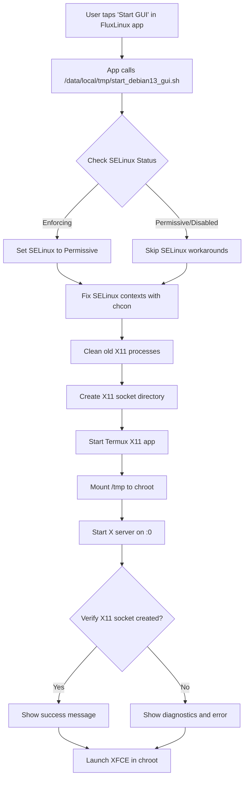

# HyperOS X11 Compatibility Fix

## Overview

This document explains the HyperOS-specific modifications made to FluxLinux's Debian 13 chroot GUI launcher to fix X11 connection and freezing issues.

## The Problem

### Symptoms
- Termux X11 app shows "Not connected" instead of desktop
- GUI fails to launch in chroot environment
- Frequent freezing during use

### Root Cause: SELinux Enforcing Mode

HyperOS (Xiaomi's Android skin) runs **SELinux in enforcing mode** by default, which blocks:
1. **X11 socket access** - Prevents chroot from accessing `/tmp/.X11-unix/X0` socket
2. **Bind mounts** - Blocks mounting Termux's `/tmp` to chroot's `/tmp`
3. **Cross-context communication** - Denies operations across security contexts

This issue **does not occur on AOSP custom ROMs**, confirming it's HyperOS-specific.

## How the Fix Works

### Script Generation Process

The fix is implemented in [`setup_debian13_chroot.sh`](file:///home/abhay/repos/fluxlinux/app/src/main/assets/scripts/chroot/setup_debian13_chroot.sh), which **generates** the GUI launcher script at `/data/local/tmp/start_debian13_gui.sh` during chroot installation.

#### When is the Script Generated?

The launcher script is created in two scenarios:

1. **During initial chroot setup** (lines 412-454):
   ```bash
   # After configuring chroot environment
   configure_debian_chroot
   
   # Generate launcher scripts
   LAUNCH_SCRIPT="/data/local/tmp/start_debian13_gui.sh"
   cat <<EOFGUI > "$GUI_LAUNCHER"
   # ... HyperOS-compatible script content ...
   EOFGUI
   ```

2. **When regenerating scripts** (lines 346-381):
   ```bash
   if [ -f "$DEBIANPATH/.flux_configured" ]; then
       # Chroot already installed, regenerate scripts
       cat <<EOFGUI > "$LAUNCH_SCRIPT"
       # ... script content ...
       EOFGUI
   fi
   ```

#### How Does It Detect HyperOS?

**It doesn't!** The script is **universal** and works on all Android versions:

- **On HyperOS**: Detects SELinux enforcing mode and applies workarounds
- **On AOSP ROMs**: Detects SELinux permissive/disabled and skips workarounds
- **Runtime detection**: Checks SELinux status when the script runs, not during generation

```bash
# Runtime SELinux detection (in generated script)
SELINUX_STATUS=$(getenforce)

if [ "$SELINUX_STATUS" = "Enforcing" ]; then
    # Apply HyperOS workarounds
    setenforce 0
    chcon -R u:object_r:tmpfs:s0 /tmp
else
    # Skip workarounds on AOSP
fi
```

### Key Components of the Fix

#### 1. SELinux Auto-Detection (Lines 476-489)

```bash
SELINUX_STATUS=$(getenforce)
echo "[INFO] SELinux Status: $SELINUX_STATUS"

if [ "$SELINUX_STATUS" = "Enforcing" ]; then
    echo "[FIX] Setting SELinux to Permissive for X11..."
    setenforce 0
    if [ "$(getenforce)" = "Permissive" ]; then
        echo "[OK] SELinux set to Permissive"
    fi
fi
```

**Why**: SELinux enforcing mode blocks X11 socket access. Setting to permissive allows the connection.

**Security Note**: This is temporary and resets to enforcing on reboot.

#### 2. SELinux Context Relabeling (Lines 503-507)

```bash
if command -v chcon >/dev/null 2>&1; then
    chcon -R u:object_r:tmpfs:s0 $TARGET_TERMUX_PREFIX/tmp
    chcon u:object_r:tmpfs:s0 $TARGET_TERMUX_PREFIX/tmp/.X11-unix
fi
```

**Why**: Even in permissive mode, incorrect SELinux labels can cause issues. This ensures `/tmp` and X11 sockets have the correct security context.

#### 3. Debug Logging (Line 520)

```bash
export TERMUX_X11_DEBUG=1
$TARGET_TERMUX_PREFIX/bin/termux-x11 :0 -ac > /tmp/termux-x11.log 2>&1 &
```

**Why**: Enables verbose logging to `/tmp/termux-x11.log` for troubleshooting connection failures.

#### 4. Socket Verification (Lines 527-545)

```bash
if [ -S "$TARGET_TERMUX_PREFIX/tmp/.X11-unix/X0" ]; then
    echo "[OK] X11 socket created successfully"
    ls -laZ $TARGET_TERMUX_PREFIX/tmp/.X11-unix/
else
    echo "[ERROR] X11 socket NOT created!"
    # Show diagnostics
    ps aux | grep termux-x11
    dmesg | grep "avc.*denied.*termux"
fi
```

**Why**: Verifies the X11 socket was created and shows detailed diagnostics if it fails, making troubleshooting easier.

## Technical Details

### Heredoc Syntax

The script uses an **unquoted heredoc** to allow variable expansion:

```bash
cat <<EOFGUI > "$GUI_LAUNCHER"
#!/bin/sh
SELINUX_STATUS=$(getenforce)  # This expands at runtime
BB="\$BB"                      # This preserves $BB for runtime
EOFGUI
```

**Why unquoted?**
- `<<EOFGUI` (unquoted): Variables expand when script runs
- `<<'EOFGUI'` (quoted): Variables are literal text (causes syntax errors)

### Variable Escaping

Only `$BB` is escaped because it needs to reference the runtime Busybox path:

```bash
BB="\$BB"  # Becomes: BB="$BB" in generated script
           # At runtime: BB="/data/adb/magisk/busybox"
```

All other variables (`$SELINUX_STATUS`, `$X11_PID`, etc.) are NOT escaped so they expand at runtime.

### DISPLAY Standardization

Changed from `:1` to `:0` across all scripts:

**Before**:
- PRoot: `termux-x11 :1` and `DISPLAY=:1`
- Chroot: `termux-x11 :0` and `DISPLAY=:0`
- **Result**: Connection mismatch

**After**:
- All scripts: `termux-x11 :0` and `DISPLAY=:0`
- **Result**: Consistent connection

## Execution Flow



## Why This Approach?

### Alternative Approaches Considered

1. **Separate HyperOS-specific script**
   - ❌ Requires manual ROM detection
   - ❌ Maintenance burden (two scripts)
   - ❌ User confusion about which to use

2. **Magisk module for SELinux policy**
   - ❌ Requires Magisk expertise
   - ❌ Device-specific policies
   - ❌ Risk of bootloop

3. **Always run in permissive mode**
   - ❌ Security risk
   - ❌ Unnecessary on AOSP ROMs

### Chosen Approach: Runtime Detection

✅ **Universal**: Works on all Android versions
✅ **Automatic**: No user intervention needed
✅ **Safe**: Only applies workarounds when necessary
✅ **Maintainable**: Single script for all ROMs
✅ **Debuggable**: Comprehensive logging and diagnostics

## Files Modified

| File | Changes | Lines |
|------|---------|-------|
| [`setup_debian13_chroot.sh`](file:///home/abhay/repos/fluxlinux/app/src/main/assets/scripts/chroot/setup_debian13_chroot.sh) | Enhanced GUI launcher generation | 463-577 |
| [`start_gui.sh`](file:///home/abhay/repos/fluxlinux/app/src/main/assets/scripts/common/start_gui.sh) | Fixed DISPLAY mismatch | 15, 27, 29 |

## Testing

### Verification Steps

1. Install app: `./gradlew installDebug`
2. Launch "Debian 13 Chroot GUI" from FluxLinux app
3. Check output for:
   - `[OK] SELinux set to Permissive` (on HyperOS)
   - `[OK] X11 socket created successfully`
   - `[OK] X11 server running`
4. Verify Termux X11 shows XFCE desktop

### Expected Behavior

**On HyperOS**:
```
[INFO] SELinux Status: Enforcing
[FIX] Setting SELinux to Permissive for X11...
[OK] SELinux set to Permissive
[3/7] Fixing SELinux contexts...
[OK] X11 socket created successfully
```

**On AOSP**:
```
[INFO] SELinux Status: Permissive
[OK] X11 socket created successfully
```

## Troubleshooting

If issues persist, check:

1. **SELinux denials**: `dmesg | grep "avc.*denied"`
2. **X11 logs**: `cat /tmp/termux-x11.log`
3. **Socket permissions**: `ls -laZ /data/data/com.termux/files/usr/tmp/.X11-unix/`

## References

- [Android SELinux Documentation](https://source.android.com/docs/security/features/selinux)
- [Termux X11 GitHub](https://github.com/termux/termux-x11)
- [HyperOS SELinux Issues](https://github.com/termux/termux-x11/issues)
