# FluxLinux Script Execution Workflow

This document provides a comprehensive overview of how the FluxLinux Android app handles script execution, from user interaction to script completion and callback handling.

---

## Table of Contents

- [High-Level Architecture](#high-level-architecture)
- [Core Components](#core-components)
- [Execution Flows](#execution-flows)
  - [Base Distro Installation](#base-distro-installation)
  - [Component Installation](#component-installation)
  - [GUI Launch/Stop](#gui-launchstop)
  - [CLI Launch](#cli-launch)
  - [Distro Uninstallation](#distro-uninstallation)
- [Script Delivery Methods](#script-delivery-methods)
- [Callback Mechanism](#callback-mechanism)
- [Installation Queue System](#installation-queue-system)
- [Script Encoding & Safety](#script-encoding--safety)
- [Context-Specific Execution](#context-specific-execution)

---

## High-Level Architecture

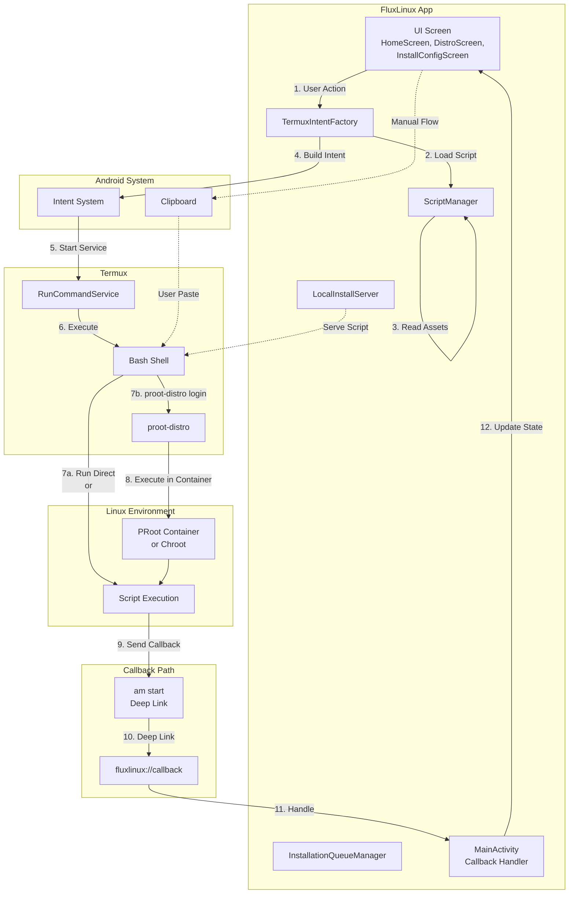

---

## Core Components

### TermuxIntentFactory

**File:** `core/data/TermuxIntentFactory.kt`

The central factory for creating all Termux-related intents. Key responsibilities:

| Method | Purpose |
|--------|---------|
| `buildRunCommandIntent()` | Creates base intent for Termux RUN_COMMAND |
| `buildInstallIntent()` | Builds distro installation intent |
| `buildUninstallIntent()` | Builds distro removal intent |
| `buildLaunchCliIntent()` | Builds CLI entry intent |
| `buildLaunchGuiIntent()` | Builds GUI launch intent |
| `buildStopGuiIntent()` | Builds GUI stop intent |
| `buildRunFeatureScriptIntent()` | Builds component script intent |
| `buildRunRootScriptIntent()` | Builds root script intent |
| `getBaseInstallScript()` | Generates compound installation script |
| `getSafeRootManualCommand()` | Generates safe clipboard command |

**Intent Constants:**
```kotlin
private const val ACTION_RUN_COMMAND = "com.termux.RUN_COMMAND"
private const val EXTRA_COMMAND_PATH = "com.termux.RUN_COMMAND_PATH"
private const val EXTRA_ARGUMENTS = "com.termux.RUN_COMMAND_ARGUMENTS"
private const val EXTRA_WORKDIR = "com.termux.RUN_COMMAND_WORKDIR"
private const val EXTRA_BACKGROUND = "com.termux.RUN_COMMAND_BACKGROUND"
```

---

### ScriptManager

**File:** `core/data/ScriptManager.kt`

Reads script files from the app's assets folder:

```kotlin
class ScriptManager(private val context: Context) {
    fun getScriptContent(fileName: String): String {
        val inputStream = context.assets.open("scripts/$fileName")
        return inputStream.bufferedReader().use { it.readText() }
    }
}
```

**Asset Path Mapping:**
- `scripts/termux/*` → Termux scripts
- `scripts/common/*` → PRoot/Chroot common scripts
- `scripts/chroot/*` → Chroot-specific scripts

---

### InstallationQueueManager

**File:** `core/utils/InstallationQueueManager.kt`

Manages multi-step installations with reactive state:

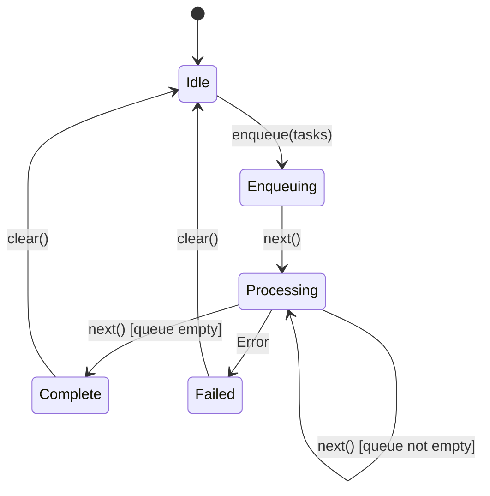

**Task Types:**
| Type | Description | Execution |
|------|-------------|-----------|
| `BASE_INSTALL` | Base distro setup | Manual (clipboard) |
| `HW_ACCEL` | Hardware acceleration | Automatic (intent) |
| `COMPONENT` | Feature/component script | Automatic (intent) |

---

### LocalInstallServer

**File:** `core/utils/LocalInstallServer.kt`

A lightweight HTTP server for serving large scripts to Termux:

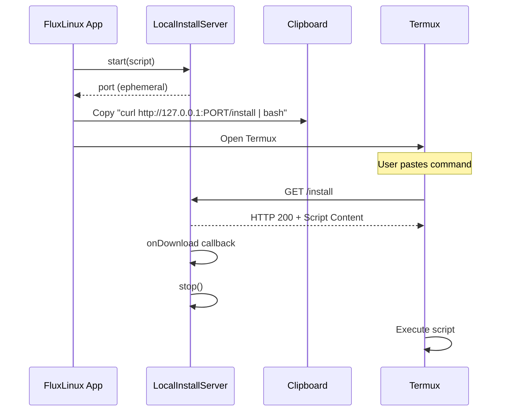

**Why use a server?**
- Avoids clipboard size limits
- Handles special characters safely
- Supports GZIP compression for large scripts
- Cleaner user experience

---

### MainActivity (Callback Handler)

**File:** `MainActivity.kt`

Handles deep link callbacks from scripts:

```kotlin
override fun onNewIntent(intent: Intent) {
    super.onNewIntent(intent)
    handleScriptCallback(intent)
}

private fun handleScriptCallback(intent: Intent) {
    if (intent.action == Intent.ACTION_VIEW && 
        intent.data?.scheme == "fluxlinux") {
        val result = uri?.getQueryParameter("result")
        val scriptName = uri?.getQueryParameter("name")
        // Process result, update state, advance queue
    }
}
```

---

## Execution Flows

### Base Distro Installation

This is the most complex flow, involving manual user interaction:

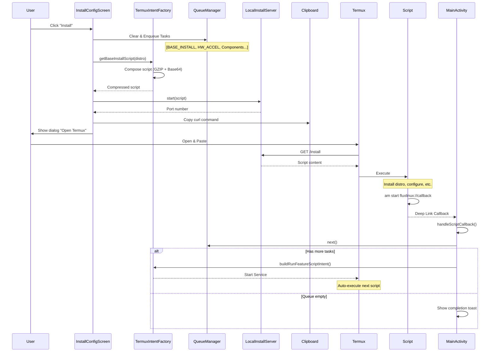

---

### Component Installation

Automatic flow after base installation or from Distro Settings:

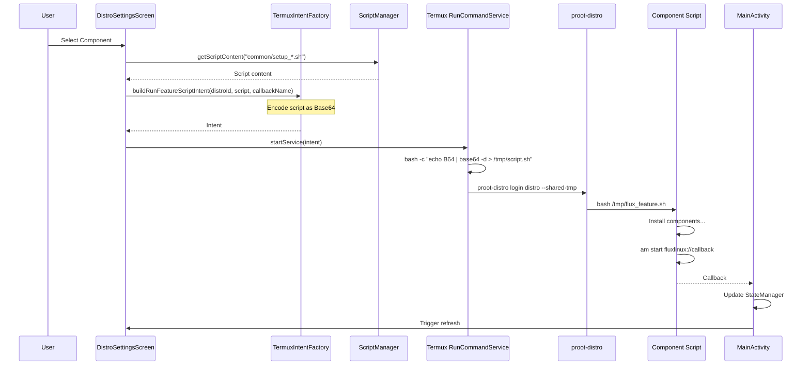

---

### GUI Launch/Stop

```mermaid
flowchart TD
    subgraph "GUI Launch Flow"
        A[User clicks Start GUI] --> B{Distro Type?}
        B -->|PRoot| C[buildLaunchGuiIntent]
        B -->|Chroot| D[buildLaunchGuiIntent<br/>+ VirGL + PulseAudio]
        C --> E["bash $HOME/start_gui.sh distroId"]
        D --> F["su -c 'sh /data/local/tmp/start_*.sh'"]
        E --> G[start_gui.sh]
        F --> H[start_*_gui.sh]
        G --> I[Kill old X11 processes]
        H --> I
        I --> J[Start PulseAudio]
        J --> K[Start Termux:X11]
        K --> L{Distro Type?}
        L -->|PRoot| M[proot-distro login --shared-tmp]
        L -->|Chroot| N[chroot with mounts]
        M --> O[dbus-launch startxfce4]
        N --> O
    end
    
    subgraph "GUI Stop Flow"
        P[User clicks Stop GUI] --> Q{Distro Type?}
        Q -->|PRoot| R["bash $HOME/stop_gui.sh distroId"]
        Q -->|Chroot| S["su -c 'sh /data/local/tmp/stop_*.sh'"]
        R --> T[Kill XFCE4 processes]
        S --> T
        T --> U[Stop Termux:X11]
        U --> V[Stop PulseAudio]
        V --> W[Clean up sockets]
    end
```

---

### CLI Launch

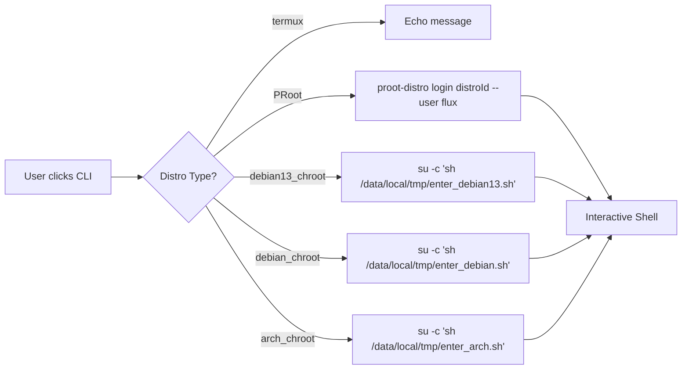

---

### Distro Uninstallation

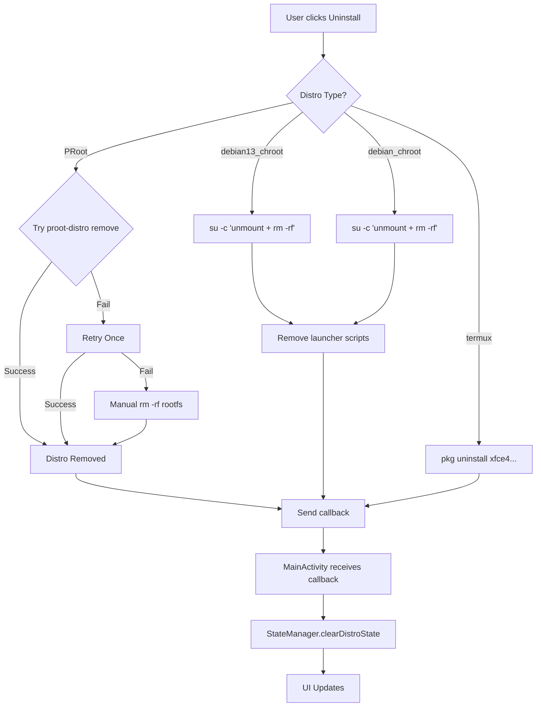

---

## Script Delivery Methods

FluxLinux uses multiple methods to deliver scripts to Termux:

### 1. Direct Intent (Small Scripts)


**Used for:** Simple commands, quick actions

### 2. Base64 Inline (Medium Scripts)


**Used for:** Component scripts, feature installations

### 3. GZIP + Base64 + LocalServer (Large Scripts)


**Used for:** Base installation (combines multiple scripts)

### 4. Clipboard + Manual (Root Required)

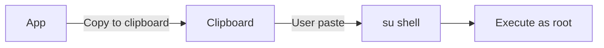

**Used for:** Chroot installations requiring root

---

## Callback Mechanism

### Deep Link Format

```
fluxlinux://callback?result=<result>&name=<name>[&components=<list>]
```

| Parameter | Values | Description |
|-----------|--------|-------------|
| `result` | `success`, `failure` | Script execution result |
| `name` | Script identifier | e.g., `setup_termux`, `distro_install_debian` |
| `components` | Comma-separated IDs | (Legacy) Installed components |

### Script Callback Implementation

```bash
# Success callback
am start -a android.intent.action.VIEW \
    -d "fluxlinux://callback?result=success&name=component_id"

# Failure callback
am start -a android.intent.action.VIEW \
    -d "fluxlinux://callback?result=failure&name=component_id"
```

### Callback Processing Flow

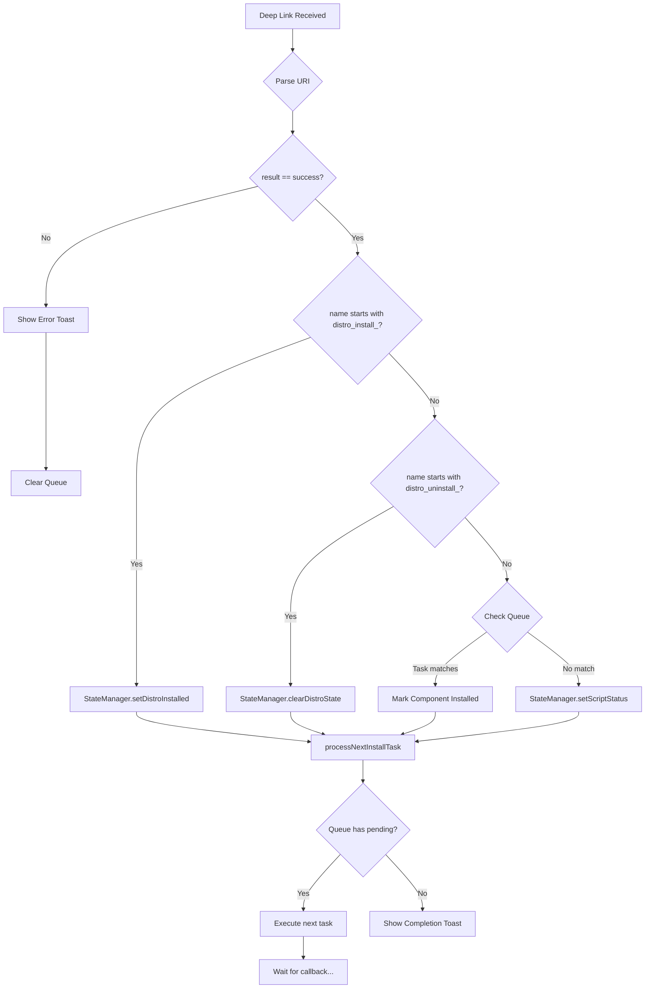

---

## Installation Queue System

### Task Lifecycle

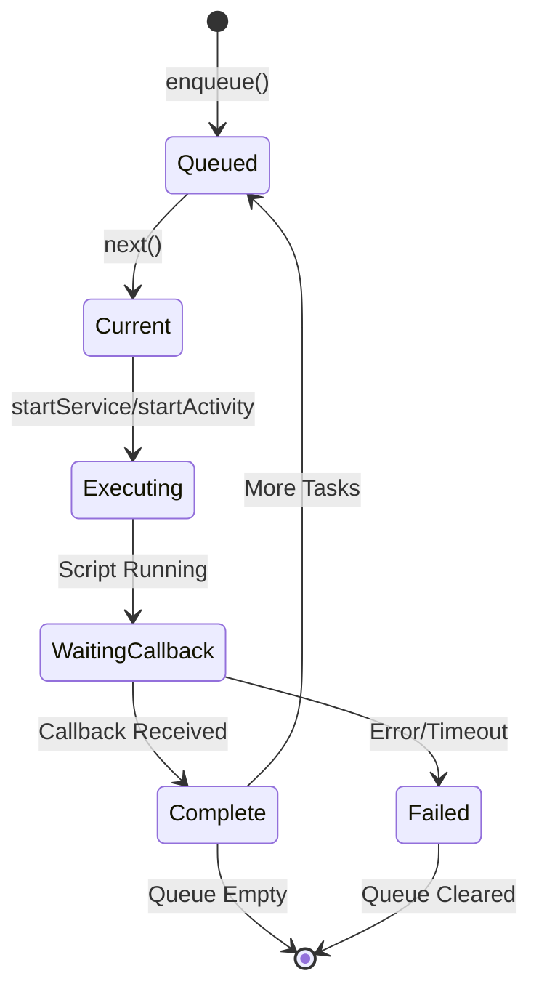

### Queue State Flow

```kotlin
// Enqueue Phase
queueManager.clear()
queueManager.enqueue(listOf(
    InstallTask(type = BASE_INSTALL, isManual = true, ...),
    InstallTask(type = HW_ACCEL, scriptName = "common/setup_hw_accel_debian.sh", ...),
    InstallTask(type = COMPONENT, scriptName = "common/setup_webdev_debian.sh", ...)
))

// Processing Phase
val task = queueManager.next()  // Gets BASE_INSTALL
// ... Manual execution via clipboard ...
// ... Callback received ...

val task = queueManager.next()  // Gets HW_ACCEL
// ... Auto execution via intent ...
// ... Callback received ...

// Completion
if (!queueManager.hasPending()) {
    StateManager.setDistroInstalled(context, distroId, true)
    queueManager.clear()
}
```

---

## Script Encoding & Safety

### Base64 Encoding

Scripts are encoded to avoid shell escaping issues:

```kotlin
val scriptB64 = android.util.Base64.encodeToString(
    scriptContent.toByteArray(), 
    android.util.Base64.NO_WRAP
)
```

### GZIP Compression

For large scripts (base install combines multiple):

```kotlin
val byteArrayOutputStream = java.io.ByteArrayOutputStream()
java.util.zip.GZIPOutputStream(byteArrayOutputStream).use { 
    it.write(safeScript.toByteArray()) 
}
val fullScriptGzipB64 = android.util.Base64.encodeToString(
    byteArrayOutputStream.toByteArray(), 
    android.util.Base64.NO_WRAP
)
```

### Heredoc with Random EOF

To prevent command injection:

```kotlin
val eofMarker = "EOF_FLUX_INSTALL_${System.currentTimeMillis()}"
val command = """
    cat << '$eofMarker' > script.sh
    $scriptContent
    $eofMarker
    bash script.sh
""".trimIndent()
```

---

## Context-Specific Execution

### PRoot Execution

```bash
# Command wrapping for PRoot
proot-distro login $distroId --shared-tmp -- bash -c "
    export PATH=/usr/local/sbin:/usr/local/bin:/usr/sbin:/usr/bin:/sbin:/bin
    bash /data/data/com.termux/files/home/flux_feature.sh
"
```

### Chroot Execution

```bash
# Command wrapping for Chroot (via run_debian13_root.sh helper)
ROOT_RUNNER="/data/local/tmp/run_debian13_root.sh"
if [ -f "$ROOT_RUNNER" ]; then
    sh "$ROOT_RUNNER" "bash /tmp/flux_feature.sh"
else
    # Fallback: inline mounts
    mnt=/data/local/tmp/chrootDebian13
    mount -t proc proc $mnt/proc
    mount -o bind /dev $mnt/dev
    # ... more mounts ...
    busybox chroot $mnt /bin/su - root -c "bash /tmp/flux_feature.sh"
fi
```

### Root Shell Execution

```bash
# Direct root execution
su -c '
    echo "BASE64_SCRIPT" | base64 -d > /data/local/tmp/task.sh
    chmod +x /data/local/tmp/task.sh
    sh /data/local/tmp/task.sh
    rm -f /data/local/tmp/task.sh
'
```

---

## Sequence Diagrams by User Action

### Complete Install Flow

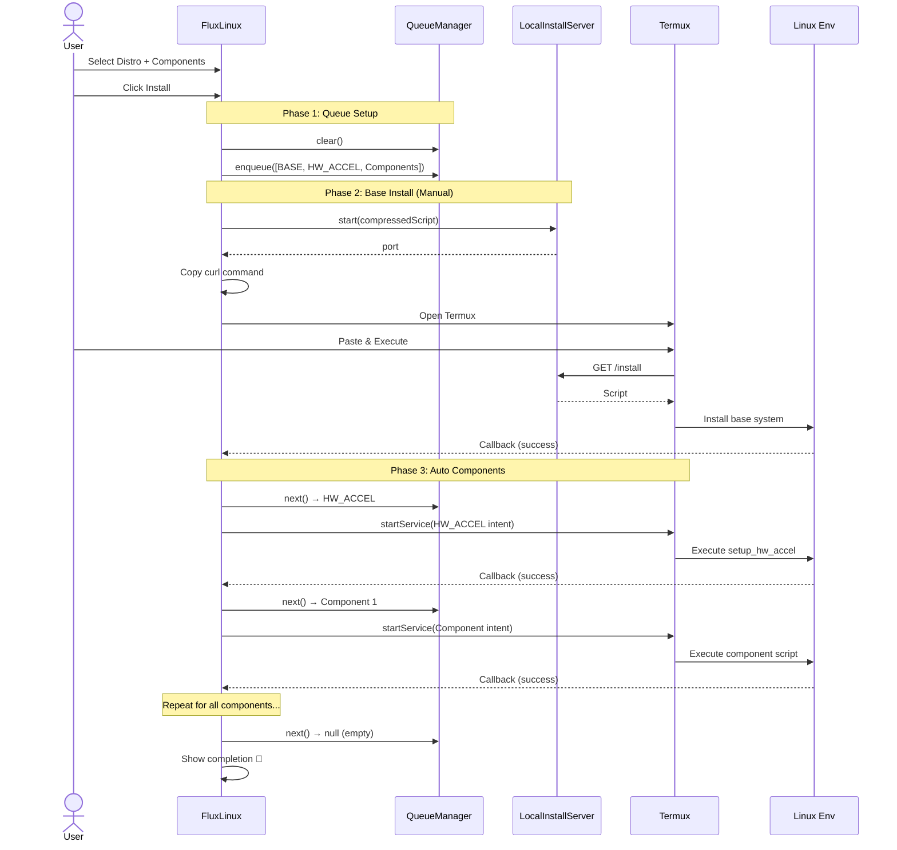

---

## Error Handling

### Script Error Handling

```bash
# Pattern used in scripts
handle_error() {
    echo "❌ FluxLinux Error: Script failed at step: $1"
    read -p "Press Enter to acknowledge error and exit..."
    exit 1
}

# Usage
apt install -y package || handle_error "Package Installation"
```

### App-Side Error Handling

```kotlin
// On failure callback
if (result != "success") {
    Toast.makeText(this, "Task '$scriptName' failed! ❌", Toast.LENGTH_LONG).show()
    InstallationQueueManager.clear() // Stop queue on failure
}
```

---

## See Also

- [Scripts Reference](scripts_reference.md) - Complete script documentation
- [Architecture Documentation](architecture.md) - Overall app architecture
- [Components Documentation](components.md) - Available installation components
