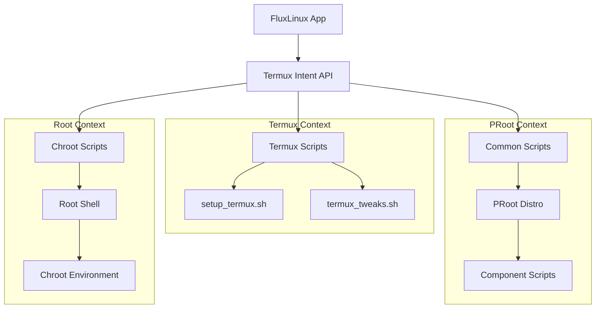
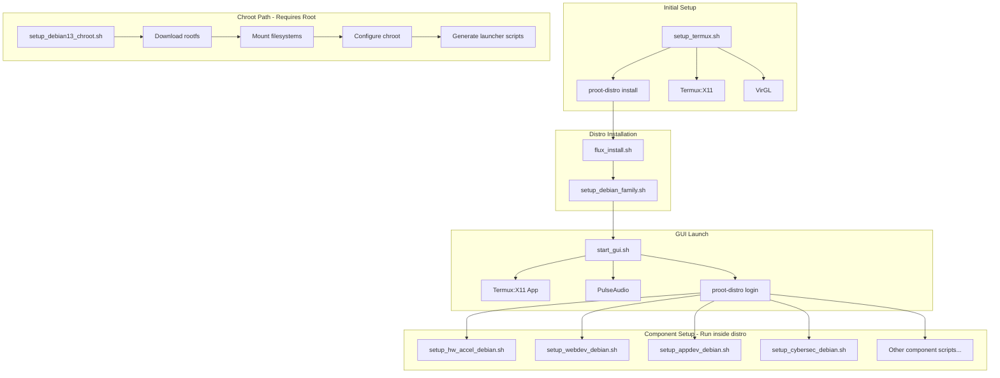

# FluxLinux Scripts Reference

This document provides a comprehensive overview of all scripts used in the FluxLinux project. Scripts are organized by category and include their purpose, execution context, and key functionality.

---

## Table of Contents

- [Architecture Overview](#architecture-overview)
- [Script Categories](#script-categories)
  - [Termux Scripts](#termux-scripts)
  - [Common Scripts (PRoot)](#common-scripts-proot)
  - [Chroot Scripts (Root Required)](#chroot-scripts-root-required)
- [Script Dependency Graph](#script-dependency-graph)
- [Execution Contexts](#execution-contexts)
- [Script Details](#script-details)

---

## Architecture Overview

FluxLinux uses a layered script architecture:



---

## Script Categories

### Termux Scripts
**Location:** `app/src/main/assets/scripts/termux/`

Scripts that run directly in Termux without root or container environments.

| Script | Purpose |
|--------|---------|
| [install.sh](#termux-installsh) | Native XFCE4 installation for Termux |
| [install_apps.sh](#termux-install_appssh) | Firefox and VS Code installation via tur-repo |
| [setup_theme.sh](#termux-setup_themesh) | Nerd Fonts installation for Termux |

---

### Common Scripts (PRoot)
**Location:** `app/src/main/assets/scripts/common/`

Scripts that run inside PRoot-Distro containers (rootless). These can also be used in Chroot environments.

#### Core Setup Scripts

| Script | Purpose |
|--------|---------|
| [setup_termux.sh](#setup_termuxsh) | Core Termux initialization, installs proot-distro, X11, VirGL |
| [setup_debian_family.sh](#setup_debian_familysh) | Generic post-install for Debian-based distros |
| [flux_install.sh](#flux_installsh) | PRoot distro installation orchestrator |
| [termux_tweaks.sh](#termux_tweakssh) | Oh My Zsh, themes, fonts, and fastfetch for Termux |

#### GUI Management Scripts

| Script | Purpose |
|--------|---------|
| [start_gui.sh](#start_guish) | Launch XFCE4 desktop via Termux:X11 (PRoot) |
| [stop_gui.sh](#stop_guish) | Stop XFCE4 desktop and related services (PRoot) |

#### Hardware Acceleration Scripts

| Script | Purpose |
|--------|---------|
| [setup_hw_accel_debian.sh](#setup_hw_accel_debiansh) | Turnip/VirGL GPU acceleration setup |
| [setup_gpu.sh](#setup_gpush) | GPU configuration helper |
| [gpu_diagnostics.sh](#gpu_diagnosticssh) | GPU troubleshooting and diagnostics |

#### Component Installation Scripts

| Script | Purpose | Components Installed |
|--------|---------|---------------------|
| [setup_webdev_debian.sh](#setup_webdev_debiansh) | Web Development stack | Node.js, Python, VS Code, Firefox, Chromium, Antigravity |
| [setup_appdev_debian.sh](#setup_appdev_debiansh) | App Development stack | Android SDK, Flutter, Kotlin, IntelliJ, Gradle |
| [setup_cybersec_debian.sh](#setup_cybersec_debiansh) | Cybersecurity tools | Nmap, Wireshark, Metasploit, John, Hydra, sqlmap |
| [setup_office_debian.sh](#setup_office_debiansh) | Office productivity | LibreOffice, Thunderbird, Evince, Xournal++ |
| [setup_emulation_debian.sh](#setup_emulation_debiansh) | Gaming & emulation | Box64, Wine (xow64), Heroic, RetroArch, DOSBox |
| [setup_gamedev_debian.sh](#setup_gamedev_debiansh) | Game development | Godot, Blender, GIMP, development tools |
| [setup_gengdev_debian.sh](#setup_gengdev_debiansh) | General development | Multiple programming languages and tools |
| [setup_datascience_debian.sh](#setup_datascience_debiansh) | Data science | Python, Jupyter, pandas, matplotlib, etc. |
| [setup_graphic_design_debian.sh](#setup_graphic_design_debiansh) | Graphic design | GIMP, Inkscape, Krita |
| [setup_video_editing_debian.sh](#setup_video_editing_debiansh) | Video editing | Kdenlive, Audacity, Blender |
| [setup_customization_debian.sh](#setup_customization_debiansh) | Desktop customization | Themes, icons, cursors, wallpapers, Zsh |

---

### Chroot Scripts (Root Required)
**Location:** `app/src/main/assets/scripts/chroot/`

Scripts that require root access for chroot-based container management.

#### Setup Scripts

| Script | Purpose |
|--------|---------|
| [setup_debian13_chroot.sh](#setup_debian13_chrootsh) | Debian 13 (Trixie) chroot installation |
| [setup_debian_chroot.sh](#setup_debian_chrootsh) | Debian 12 chroot installation |
| [setup_arch_chroot.sh](#setup_arch_chrootsh) | Arch Linux ARM64 chroot installation |

#### GUI Management Scripts

| Script | Purpose |
|--------|---------|
| [stop_debian13_gui.sh](#stop_debian13_guish) | Stop Debian 13 chroot GUI session |

#### Uninstall Scripts

| Script | Purpose |
|--------|---------|
| [uninstall_debian13.sh](#uninstall_debian13sh) | Remove Debian 13 chroot environment |
| [uninstall_debian_chroot.sh](#uninstall_debian_chrootsh) | Remove Debian 12 chroot environment |

---

## Script Dependency Graph



---

## Execution Contexts

### Context Types

| Context | Shell | User | Root Required | Environment |
|---------|-------|------|---------------|-------------|
| **Termux** | `/data/data/com.termux/files/usr/bin/bash` | Termux user | No | Android bionic libc |
| **PRoot** | `/bin/bash` | `flux` | No | Linux glibc (emulated) |
| **Chroot** | `/bin/bash` or `/bin/sh` | `flux` or `root` | Yes | Linux glibc (native) |
| **Root Shell** | `/bin/sh` | `root` | Yes | Android + Magisk |

### Script Location Mapping

| Directory | Execution Context | Invoked Via |
|-----------|------------------|-------------|
| `scripts/termux/` | Termux | Direct Termux execution |
| `scripts/common/` | PRoot or Chroot | `proot-distro login` or `chroot` |
| `scripts/chroot/` | Root Shell | `su -c` |

---

## Script Details

---

### Termux Scripts

---

#### termux/install.sh

**Purpose:** Native XFCE4 installation for Termux (without PRoot/Chroot)

**Execution Context:** Termux

**Key Operations:**
1. Update Termux packages
2. Install XFCE4 desktop environment
3. Install xfce4-terminal
4. Install TigerVNC

**Dependencies:** None (initial script)

```bash
# Usage
bash ~/install.sh
```

---

#### termux/install_apps.sh

**Purpose:** Install Firefox and VS Code (Code OSS) via Termux User Repository

**Execution Context:** Termux

**Key Operations:**
1. Install `tur-repo` package
2. Install Firefox from TUR
3. Install VS Code (Code OSS) from TUR

**Dependencies:** Termux with x11-repo

---

#### termux/setup_theme.sh

**Purpose:** Install Nerd Fonts for terminal icons

**Execution Context:** Termux

**Key Operations:**
1. Install curl, ncurses-utils, zip
2. Run termux-nf installer script

---

### Common Scripts (PRoot)

---

#### setup_termux.sh

**Purpose:** Core Termux environment initialization

**Execution Context:** Termux

**Marker File:** `$HOME/.fluxlinux/setup_termux.done`

**Key Operations:**
1. Clear package locks and repair dpkg
2. Update all Termux packages
3. Install core dependencies:
   - `proot-distro` - Rootless Linux containers
   - `x11-repo` - X11/GUI support
   - `pulseaudio` - Audio server
   - `termux-x11-nightly` - X11 display server
4. Install `tur-repo` and hardware acceleration tools:
   - `virglrenderer-android` - VirGL server
   - `mesa-zink` - OpenGL over Vulkan
5. Install Mali Vulkan wrapper (aarch64 only)

**Callback Intent:** `fluxlinux://callback?result=success&name=setup_termux`

---

#### setup_debian_family.sh

**Purpose:** Generic post-installation for Debian-based distros

**Execution Context:** PRoot (inside distro)

**Key Operations:**
1. Install XFCE4, goodies, dbus-x11, and TigerVNC
2. Create user `flux` with password `flux`
3. Configure sudo with NOPASSWD
4. Set up VNC xstartup file

---

#### flux_install.sh

**Purpose:** PRoot distro installation orchestrator

**Execution Context:** Termux

**Usage:** `bash flux_install.sh <distro_id> <base64_encoded_setup_script>`

**Key Operations:**
1. Check if distro already installed
2. Run `proot-distro install <distro>`
3. Decode and execute setup script inside distro
4. Create marker file for tracking
5. Send callback intent to app

**Callback Intent:** `fluxlinux://callback?result=success&name=distro_install_<distro>`

---

#### termux_tweaks.sh

**Purpose:** Enhance Termux with Oh My Zsh, themes, and fonts

**Execution Context:** Termux

**Key Operations:**
1. Install Oh My Zsh with plugins:
   - zsh-autosuggestions
   - zsh-syntax-highlighting
   - zsh-autocomplete
2. Apply color schemes (GitHub Dark, Dracula, Gruvbox)
3. Install Nerd Fonts (Meslo, FiraCode, JetBrainsMono)
4. Configure fastfetch
5. Set Zsh as default shell

**Marker File:** `$HOME/.fluxlinux/termux_tweaks.done`

---

#### start_gui.sh

**Purpose:** Launch XFCE4 desktop environment in PRoot

**Execution Context:** Termux

**Usage:** `bash start_gui.sh [distro]` (default: debian)

**Key Operations:**
1. Kill existing X11 processes
2. Start PulseAudio over TCP
3. Start termux-x11 server on display :1
4. Launch Termux:X11 Android app
5. Login to PRoot distro with shared-tmp
6. Start XFCE4 session as user `flux`

---

#### stop_gui.sh

**Purpose:** Stop XFCE4 desktop and related services

**Execution Context:** Termux

**Usage:** `bash stop_gui.sh [distro]` (default: debian)

**Key Operations:**
1. Kill XFCE4 processes inside PRoot
2. Stop Termux:X11 and Xwayland
3. Stop PulseAudio

---

#### setup_hw_accel_debian.sh

**Purpose:** Hardware acceleration setup (Turnip/VirGL)

**Execution Context:** PRoot or Chroot (as root)

**Key Operations:**
1. Detect package manager (apt/pacman)
2. Install Vulkan/Mesa dependencies
3. GPU selection menu:
   - **Turnip (Adreno):** Downloads Mesa Turnip drivers, configures Zink
   - **VirGL (Universal):** Configures virpipe driver
4. Create `gpu-launch` wrapper script

**Usage:**
```bash
# After setup, use:
gpu-launch glmark2
gpu-launch glxinfo | grep 'OpenGL renderer'
```

**Environment Variables Set:**
- Turnip: `MESA_LOADER_DRIVER_OVERRIDE=zink`, `VK_ICD_FILENAMES`, `TU_DEBUG=noconform`
- VirGL: `GALLIUM_DRIVER=virpipe`, `VTEST_SOCKET_NAME=/tmp/.virgl_test`

---

#### setup_webdev_debian.sh

**Purpose:** Web Development stack installation

**Execution Context:** PRoot or Chroot (as root)

**Installed Components:**
| Component | Version/Source |
|-----------|---------------|
| Firefox | Mozilla official repo |
| Chromium | Debian repos |
| Node.js | NodeSource v23 |
| Python 3 | Debian repos |
| VS Code | Official ARM64 tarball |
| Antigravity | Google APT repo |

**Key Operations:**
1. Setup Mozilla Firefox repo with priority pinning
2. Install Firefox and Chromium
3. Setup NodeSource repo and install Node.js 23
4. Install Python 3 with pip and venv
5. Download and extract VS Code ARM64 tarball
6. Create VS Code desktop entry with `--no-sandbox` flag
7. Configure VS Code to disable extension signature verification
8. Install Antigravity package with custom wrapper

---

#### setup_appdev_debian.sh

**Purpose:** App Development stack (Android + Flutter + React Native)

**Execution Context:** PRoot or Chroot (as root)

**Installed Components:**
| Component | Version | Notes |
|-----------|---------|-------|
| OpenJDK | 21/17/default | Dynamic detection |
| Android SDK | SDK 34/35/36 | ARM64 native build-tools |
| Android NDK | r27d, r29 | ARM64 musl-based |
| Flutter | Stable | Git clone |
| Kotlin | 2.1.0 | Manual install |
| Gradle | 9.2.1 | Manual install |
| IntelliJ IDEA | 2025.3.1 | AArch64 build |

**Key Operations:**
1. Install Java (JDK 21/17)
2. Download and configure Android SDK cmdline-tools
3. Install platform-tools and platforms (SDK 34/35/36)
4. Wrap CMake/Ninja with system binaries
5. Install ARM64 native NDK from HomuHomu833/android-ndk-custom
6. Install ARM64 build-tools (aapt, aapt2, aidl, zipalign)
7. Clone Flutter SDK
8. Install Kotlin compiler
9. Install Gradle 9.2.1
10. Install IntelliJ IDEA Community

**Environment Variables Set:**
```bash
export JAVA_HOME=/usr/lib/jvm/java-21-openjdk-arm64
export ANDROID_HOME=/opt/android-sdk
export ANDROID_NDK=$ANDROID_HOME/ndk/29.0.14206865
export PATH=$PATH:$ANDROID_HOME/cmdline-tools/latest/bin
export PATH=$PATH:/opt/flutter/bin
export PATH=$PATH:/opt/gradle/bin
```

---

#### setup_cybersec_debian.sh

**Purpose:** Cybersecurity and penetration testing tools

**Execution Context:** PRoot or Chroot (as root)

**Installed Components:**
| Category | Tools |
|----------|-------|
| Network Analysis | Nmap, Wireshark, tcpdump, netcat |
| Password Cracking | John the Ripper, Hydra, Hashcat |
| WiFi Security | Aircrack-ng |
| Web Security | SQLMap, Nikto |
| Exploitation | Metasploit Framework |

**Key Operations:**
1. Enable non-free/contrib repositories
2. Install network analysis tools
3. Configure Wireshark for non-root users
4. Install Metasploit via official installer
5. Create Burp Suite wrapper (JAR method)

---

#### setup_office_debian.sh

**Purpose:** Office productivity suite

**Execution Context:** PRoot or Chroot (as root)

**Installed Components:**
| Category | Application |
|----------|-------------|
| Office Suite | LibreOffice (Writer, Calc, Impress) |
| Email Client | Thunderbird |
| PDF Viewer | Evince |
| PDF Annotation | Xournal++ |
| Fonts | Noto, Liberation, DejaVu |

---

#### setup_emulation_debian.sh

**Purpose:** Gaming and Windows emulation

**Execution Context:** PRoot or Chroot (as root)

**Installed Components:**
| Component | Purpose |
|-----------|---------|
| Box64 | x86_64 Linux binary emulation |
| xow64 | Wine integration for Windows apps |
| Heroic | Epic/GOG games launcher |
| RetroArch | Multi-system emulator |
| DOSBox | DOS emulator |

**Key Operations:**
1. Install Box64 from Ryan Fortner's repo
2. Download and patch xow64 for PRoot compatibility
3. Install Heroic Games Launcher (ARM64 .deb)
4. Install RetroArch and DOSBox

**Usage:**
```bash
# Run Windows executable
~/xow64 run <exe_file>
```

---

#### setup_customization_debian.sh

**Purpose:** Desktop customization and theming

**Execution Context:** PRoot or Chroot (as root)

**Key Operations:**
1. Download assets from GitHub release (`debian-v1`)
2. Install themes (Space-light, Space-transparency)
3. Install icons (Papirus, Papirus-Dark)
4. Install cursors (Vimix variants)
5. Set up wallpapers
6. Install JetBrains Mono Nerd Font
7. Generate XFCE4 configuration files:
   - `xsettings.xml` - Theme, icons, cursor, fonts, scaling
   - `xfwm4.xml` - Window manager settings
   - `xfce4-desktop.xml` - Wallpaper configuration
   - `xfce4-keyboard-shortcuts.xml` - Custom shortcuts
   - `xfce4-panel.xml` - Panel layout
8. Configure XFCE4 Terminal
9. Install Oh My Zsh with agnosterzak theme
10. Install pokemon-colorscripts
11. Configure fastfetch

---

### Chroot Scripts (Root Required)

---

#### setup_debian13_chroot.sh

**Purpose:** Install and configure Debian 13 (Trixie) chroot environment

**Execution Context:** Root shell

**Prerequisites:** Root access, Magisk Busybox

**Paths Used:**
| Path | Purpose |
|------|---------|
| `/data/local/tmp/chrootDebian13` | Chroot root filesystem |
| `/data/local/tmp/start_debian13.sh` | GUI launcher script |
| `/data/local/tmp/start_debian13_gui.sh` | X11 + GUI wrapper |
| `/data/local/tmp/enter_debian13.sh` | CLI entry script |
| `/data/local/tmp/run_debian13_root.sh` | Root command runner |
| `/data/local/tmp/stop_debian13_gui.sh` | GUI stop script |

**Key Operations:**
1. Detect root-capable Busybox (non-Termux paths)
2. Download rootfs from GitHub release
3. Extract rootfs with xz support
4. Mount filesystems:
   - `/dev`, `/sys`, `/proc`, `/dev/pts`
   - `/dev/shm` (tmpfs, 512M)
   - `/sdcard`
   - Termux tmp (for X11 sockets)
5. Configure network (DNS, hosts)
6. Create Android permission groups (aid_inet, aid_net_raw, aid_graphics)
7. Install packages (nano, vim, net-tools, sudo, git, dbus-x11)
8. Create user `flux` with groups
9. Install XFCE4
10. Generate launcher scripts

**Marker File:** `$DEBIANPATH/.flux_configured`

**Callback Intent:** `fluxlinux://callback?result=success&name=distro_install_debian13_chroot`

---

#### setup_debian_chroot.sh

**Purpose:** Install and configure Debian 12 chroot environment

**Execution Context:** Root shell

**Similar to:** `setup_debian13_chroot.sh` with following differences:
- Uses Debian 12 rootfs
- Different installation path: `/data/local/tmp/chrootDebian`
- Different rootfs URL

---

#### setup_arch_chroot.sh

**Purpose:** Install Arch Linux ARM64 with KDE Plasma

**Execution Context:** Root shell

**Key Differences from Debian:**
- Downloads from archlinuxarm.org
- Uses pacman package manager
- Disables CheckSpace and sandbox in pacman.conf
- Dynamic mirror selection (tests 15+ mirrors)
- Installs KDE Plasma instead of XFCE4
- Initializes pacman keys

**Generated Scripts:**
- `/data/local/tmp/enter_arch.sh` - CLI entry
- `/data/local/tmp/start_arch_gui.sh` - KDE Plasma launcher

---

#### stop_debian13_gui.sh

**Purpose:** Stop Debian 13 chroot GUI session

**Execution Context:** Root shell

**Key Operations:**
1. Detect Busybox
2. Kill XFCE4 processes inside chroot
3. Stop Termux:X11 and Xwayland
4. Clean up X11 sockets
5. Unmount all chroot filesystems

---

#### uninstall_debian13.sh

**Purpose:** Remove Debian 13 chroot environment

**Execution Context:** Root shell

**Key Operations:**
1. Kill processes with root set to chroot path
2. Dynamically unmount all mount points (deepest first)
3. Force lazy unmount for stubborn mounts
4. Remove rootfs directory
5. Remove launcher scripts

**Callback Intent:** `fluxlinux://callback?result=success&name=distro_uninstall_debian13_chroot`

---

#### uninstall_debian_chroot.sh

**Purpose:** Remove Debian 12 chroot environment

**Execution Context:** Root shell

**Similar to:** `uninstall_debian13.sh` with different paths

---

## Generated Runtime Scripts

The chroot setup scripts generate additional scripts at runtime:

### start_debian13.sh
**Location:** `/data/local/tmp/start_debian13.sh`

Mounts filesystems and starts XFCE4 GUI.

### start_debian13_gui.sh  
**Location:** `/data/local/tmp/start_debian13_gui.sh`

Full GUI launcher that:
1. Kills old processes
2. Cleans X11 sockets
3. Starts Termux:X11 app
4. Mounts Termux tmp for socket sharing
5. Starts XServer
6. Checks PulseAudio and VirGL status
7. Calls `start_debian13.sh`

### enter_debian13.sh
**Location:** `/data/local/tmp/enter_debian13.sh`

CLI-only entry to chroot (no GUI).

### run_debian13_root.sh
**Location:** `/data/local/tmp/run_debian13_root.sh`

Helper script to run commands as root inside chroot:
```bash
./run_debian13_root.sh "apt update"
```

---

## Common Patterns

### Error Handling
```bash
handle_error() {
    echo "❌ FluxLinux Error: Script failed at step: $1"
    read -p "Press Enter to acknowledge error and exit..."
    exit 1
}
```

### Progress Messages
```bash
progress() {
    printf "\033[1;36m[+] %s\033[0m\n" "$1"
}
success() {
    printf "\033[1;32m[✓] %s\033[0m\n" "$1"
}
error() {
    printf "\033[1;31m[!] %s\033[0m\n" "$1"
}
```

### Callback Intents
```bash
am start -a android.intent.action.VIEW \
    -d "fluxlinux://callback?result=success&name=<script_name>"
```

### Marker Files
Used to prevent re-running setup:
```bash
MARKER_FILE="$HOME/.fluxlinux/setup_termux.done"
if [ -f "$MARKER_FILE" ]; then
    echo "Already completed. Skipping."
    exit 0
fi
# ... do work ...
touch "$MARKER_FILE"
```

### Busybox Detection (Chroot)
```bash
BB=""
CANDIDATES="/data/adb/magisk/busybox \
/data/adb/modules/busybox-ndk/system/bin/busybox \
/sbin/busybox \
/system/xbin/busybox \
/system/bin/busybox"

for path in $CANDIDATES; do
    if [ -x "$path" ]; then
        BB="$path"
        break
    fi
done
```

---

## See Also

- [Architecture Documentation](architecture.md)
- [Components Documentation](components.md)
- [Technical Specifications](technical_specs.md)
- [Chroot Hardware Acceleration](CHROOT_HARDWARE_ACCEL.md)
