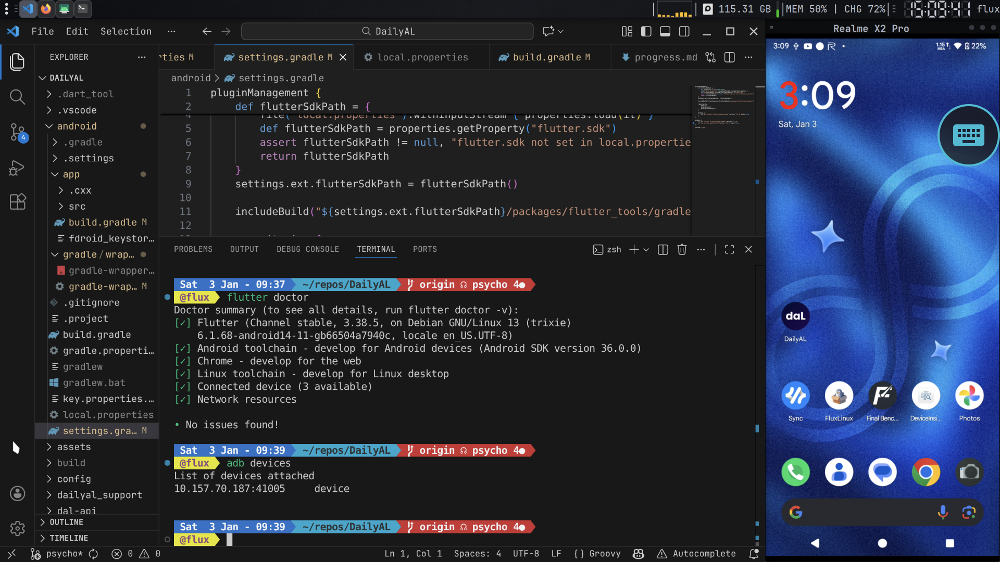
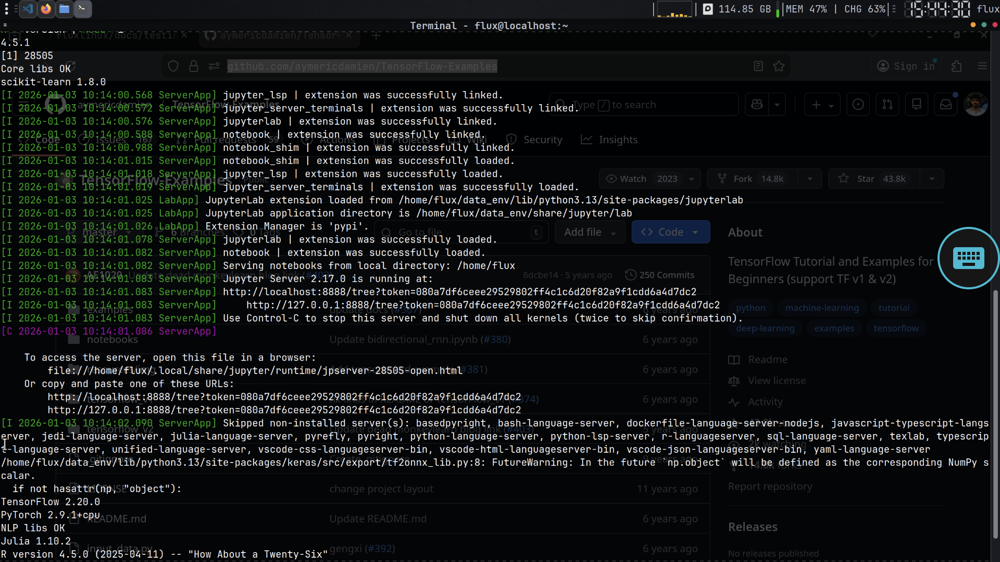
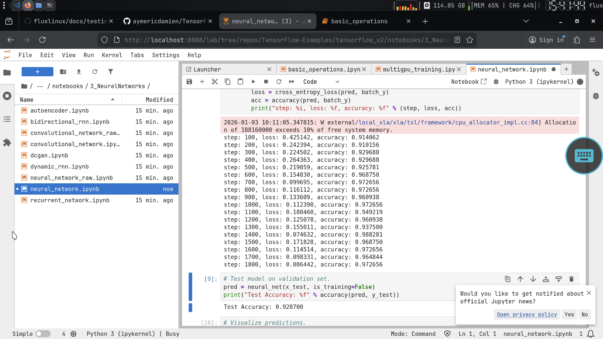
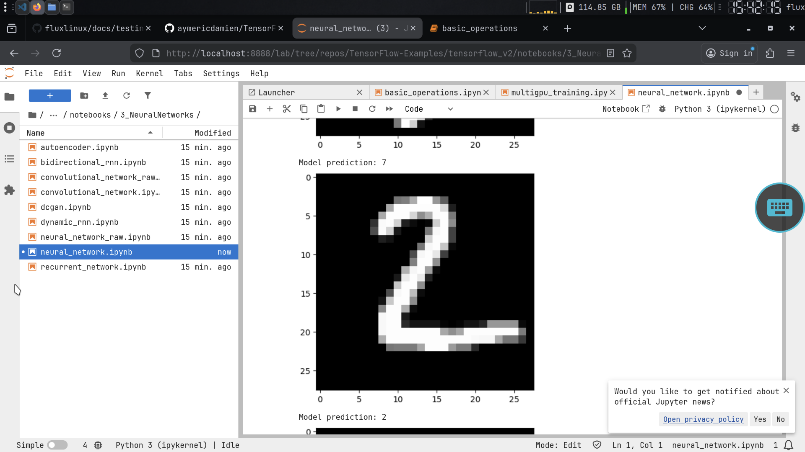
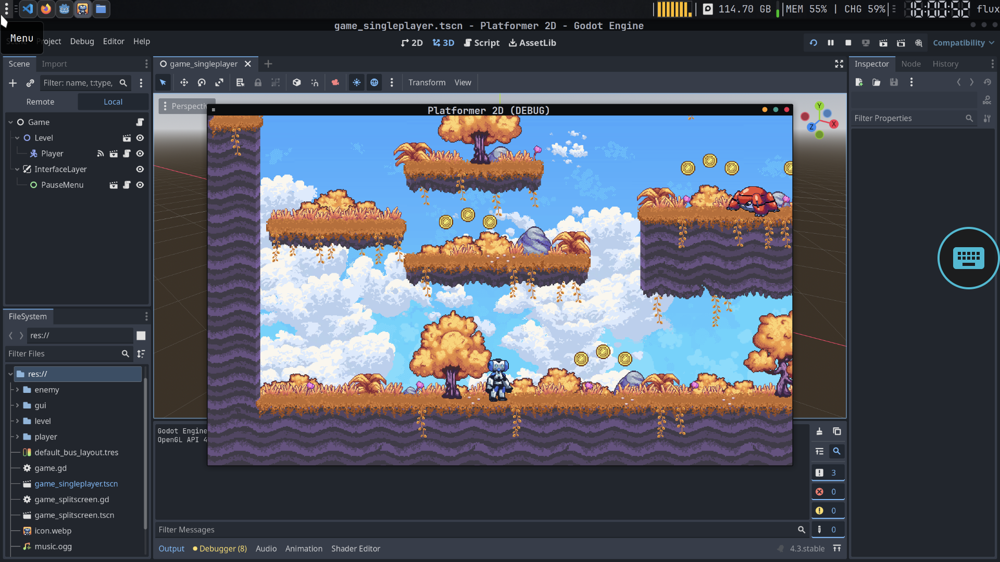
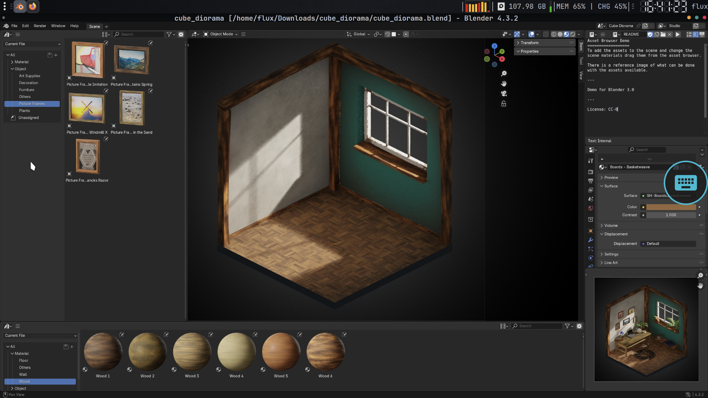

# FluxLinux Testing Reference

A comprehensive guide for testing FluxLinux's development stacks by building and running sample projects. Each category corresponds to a component installed by FluxLinux scripts.

---

## Table of Contents

- [Testing Methodology](#testing-methodology)
- [App Development](#app-development)
  - [Flutter](#flutter)
  - [Kotlin/Android](#kotlinandroid)
- [Web Development](#web-development)
  - [React](#react)
  - [Node.js](#nodejs)
- [Python Development](#python-development)
- [Data Science & AI/ML](#data-science--aiml)
- [Game Development](#game-development)
- [Graphic Design](#graphic-design)
- [Video Editing](#video-editing)
- [Cybersecurity Tools](#cybersecurity-tools)
- [Office Suite](#office-suite)
- [Emulation & Gaming](#emulation--gaming)

---

## Testing Methodology

For each category:
1. ✅ Clone the project
2. ✅ Install dependencies
3. ✅ Build the project
4. ✅ Run/test the application
5. ✅ Document any issues

**Status Legend:**
- 🟢 **Tested & Working**
- 🟡 **Partial/Issues**
- 🔴 **Not Working**
- ⬜ **Not Tested**

---

## App Development

*Script: `setup_appdev_debian.sh`*

### Flutter

**Prerequisites Test:**
```bash
flutter doctor
flutter --version
```

#### Personal Projects

| Project | Repository | Status | Notes |
|---------|------------|--------|-------|
| DailyAL | [JICA98/DailyAL](https://github.com/JICA98/DailyAL) | ⬜ | MyAnimeList daily tracker |

**Build Test:**
```bash
git clone https://github.com/JICA98/DailyAL
cd DailyAL
flutter pub get
flutter build apk --release
```

#### Official/Demo Projects

| Project | Repository | Description | Build Command |
|---------|------------|-------------|---------------|
| Flutter Samples | [flutter/samples](https://github.com/flutter/samples) | Official collection | `flutter run` |
| Flutter Examples | [nisrulz/flutter-examples](https://github.com/nisrulz/flutter-examples) | Beginner projects | `flutter run` |
| Counter App | Built-in | Default template | `flutter create test_app` |
| Gallery App | [flutter/gallery](https://github.com/flutter/gallery) | Material showcase | `flutter build apk` |

**Quick Test:**
```bash
# Create and build default Flutter app
flutter create fluxlinux_test
cd fluxlinux_test
flutter build apk
ls build/app/outputs/flutter-apk/
```

**Tested Result:**

<div align="center">
<table>
<tr>
<td></td>
<td></td>
</tr>
<tr>
<td align="center"><em>Flutter Doctor</em></td>
<td align="center"><em>Flutter App Running</em></td>
</tr>
</table>
</div>

---

### Kotlin/Android

**Prerequisites Test:**
```bash
java -version
kotlin -version
gradle --version
```

#### Personal Projects

| Project | Repository | Status | Notes |
|---------|------------|--------|-------|
| Benchmark Platform | [abhay-byte/finalbenchmark-platform](https://github.com/abhay-byte/finalbenchmark-platform) | ⬜ | Kotlin benchmark app |

**Build Test:**
```bash
git clone https://github.com/abhay-byte/finalbenchmark-platform
cd finalbenchmark-platform
./gradlew assembleDebug
```

#### Official/Demo Projects

| Project | Repository | Description | Status |
|---------|------------|-------------|--------|
| Now in Android | [android/nowinandroid](https://github.com/android/nowinandroid) | Official reference app | ⬜ |
| Architecture Samples | [android/architecture-samples](https://github.com/android/architecture-samples) | Best practices | ⬜ |
| Sunflower | [android/sunflower](https://github.com/android/sunflower) | Jetpack showcase | ⬜ |
| Compose Samples | [android/compose-samples](https://github.com/android/compose-samples) | Compose UI examples | ⬜ |

**Quick Test:**
```bash
# Clone and build official sample
git clone https://github.com/android/nowinandroid
cd nowinandroid
./gradlew assembleDebug
```

**Tested Result:**

<div align="center">

<p><em>Kotlin/Gradle Build</em></p>
</div>

---

## Web Development

*Script: `setup_webdev_debian.sh`*

### React

**Prerequisites Test:**
```bash
node --version
npm --version
```

#### Personal Projects

| Project | Repository | Status | Notes |
|---------|------------|--------|-------|
| Clinico Frontend | [abhay-byte/Clinicofrontend](https://github.com/abhay-byte/Clinicofrontend) | ⬜ | Medical clinic UI |

**Build Test:**
```bash
git clone https://github.com/abhay-byte/Clinicofrontend
cd Clinicofrontend
npm install
npm run build
```

#### Demo Projects

| Project | Repository | Description | Build Command |
|---------|------------|-------------|---------------|
| Create React App | [facebook/create-react-app](https://github.com/facebook/create-react-app) | Official starter (deprecated, use Vite) | `npx create-react-app test-app` |
| Vite | [vitejs/vite](https://github.com/vitejs/vite) | Modern build tooling | `npm create vite@latest my-app -- --template react` |
| MDN Todo App | [mdn/todo-react](https://github.com/mdn/todo-react) | Mozilla tutorial project | `npm install && npm start` |
| React Todo Redux | [ShaifArfan/react-todo-app](https://github.com/ShaifArfan/react-todo-app) | Redux + Framer Motion | `npm install && npm start` |

**Quick Test:**
```bash
# Create and build React app
npx create-react-app fluxlinux-test
cd fluxlinux-test
npm run build
npm start
```

### Node.js

**Quick Test:**
```bash
# Test Node.js installation
node -e "console.log('Node.js ' + process.version + ' working!')"

# Test npm packages
npm init -y
npm install express
node -e "require('express'); console.log('Express installed!')"
```

**Tested Result:**

<div align="center">

<p><em>React App Running in Browser</em></p>
</div>

---

## Python Development

*Script: `setup_webdev_debian.sh` (Python included)*

**Prerequisites Test:**
```bash
python3 --version
pip3 --version
```

#### Personal Projects

| Project | Repository | Status | Notes |
|---------|------------|--------|-------|
| AI Wrapper Projects | [abhay-byte/AI_WRAPPER_PROJECTS](https://github.com/abhay-byte/AI_WRAPPER_PROJECTS) | ⬜ | Gemini API wrapper |
| Cura Backend | [abhay-byte/cura-backend](https://github.com/abhay-byte/cura-backend) | ⬜ | Flask backend |

**Build Test:**
```bash
git clone https://github.com/abhay-byte/cura-backend
cd cura-backend
pip3 install -r requirements.txt
python3 app.py
```

#### Demo Projects

| Project | Repository | Description | Command |
|---------|------------|-------------|---------|
| Flask (framework) | [pallets/flask](https://github.com/pallets/flask) | Micro web framework | `pip install flask` |
| Flask Tutorial (Flaskr) | [pallets/flask/examples/tutorial](https://github.com/pallets/flask/tree/main/examples/tutorial) | Official blog tutorial | Inside flask repo |
| Django (framework) | [django/django](https://github.com/django/django) | Full-stack framework | `pip install django` |
| Django Tutorial | [rayed/django_tutorial](https://github.com/rayed/django_tutorial) | Official tutorial solution | `./manage.py runserver` |
| FastAPI (framework) | [tiangolo/fastapi](https://github.com/tiangolo/fastapi) | Modern async API | `pip install fastapi uvicorn` |
| FastAPI Full Stack | [fastapi/full-stack-fastapi-template](https://github.com/fastapi/full-stack-fastapi-template) | Complete template | Docker compose |

**Quick Test:**
```bash
# Create virtual environment
python3 -m venv fluxtest
source fluxtest/bin/activate

# Test Flask
pip install flask
python3 -c "from flask import Flask; print('Flask working!')"

# Test common libraries
pip install requests numpy pandas
python3 -c "import requests, numpy, pandas; print('All libraries working!')"
```

---

## Data Science & AI/ML

*Script: `setup_datascience_debian.sh`*

**Prerequisites Test:**
```bash
# Check Python environment
source ~/data_env/bin/activate
python --version
jupyter --version
julia --version
R --version
```

### Installed Packages

| Category | Libraries |
|----------|-----------|
| **Core** | Jupyter, JupyterLab, Pandas, NumPy, Matplotlib, Seaborn, SciPy |
| **ML** | scikit-learn, XGBoost |
| **Deep Learning** | TensorFlow, PyTorch, Keras |
| **NLP** | NLTK, Spacy, Transformers |
| **Languages** | Python 3, Julia, R |
| **IDEs** | PyCharm Community, Spyder |

### Demo Projects

#### Jupyter Notebooks

| Project | Repository | Description |
|---------|------------|-------------|
| Python Data Science Handbook | [jakevdp/PythonDataScienceHandbook](https://github.com/jakevdp/PythonDataScienceHandbook) | Complete book in Jupyter |
| Data Science IPython Notebooks | [donnemartin/data-science-ipython-notebooks](https://github.com/donnemartin/data-science-ipython-notebooks) | Deep learning, scikit-learn, big data |
| ML Projects Collection | [rhiever/Data-Analysis-and-Machine-Learning-Projects](https://github.com/rhiever/Data-Analysis-and-Machine-Learning-Projects) | Practical ML examples |

#### TensorFlow

| Project | Repository | Description |
|---------|------------|-------------|
| TensorFlow Tutorials | [aymericdamien/TensorFlow-Examples](https://github.com/aymericdamien/TensorFlow-Examples) | Beginner to advanced |
| Easy TensorFlow | [easy-tensorflow/easy-tensorflow](https://github.com/easy-tensorflow/easy-tensorflow) | Simple tutorials |
| Official Examples | [tensorflow/examples](https://github.com/tensorflow/examples) | Official TensorFlow examples |

#### PyTorch

| Project | Repository | Description |
|---------|------------|-------------|
| Official Examples | [pytorch/examples](https://github.com/pytorch/examples) | Vision, text, RL |
| PyTorch Tutorial | [yunjey/pytorch-tutorial](https://github.com/yunjey/pytorch-tutorial) | Deep learning researchers |
| Learn PyTorch | [mrdbourke/pytorch-deep-learning](https://github.com/mrdbourke/pytorch-deep-learning) | Zero to Mastery course |
| PyTorch Tutorials | [LukeDitria/pytorch_tutorials](https://github.com/LukeDitria/pytorch_tutorials) | Beginner with videos |

#### scikit-learn

| Project | Repository | Description |
|---------|------------|-------------|
| scikit-learn | [scikit-learn/scikit-learn](https://github.com/scikit-learn/scikit-learn) | Official repository |
| auto-sklearn | [automl/auto-sklearn](https://github.com/automl/auto-sklearn) | Automated ML toolkit |
| Examples Gallery | [scikit-learn.org/stable/auto_examples](https://scikit-learn.org/stable/auto_examples/) | Official examples |

### Quick Tests

```bash
# Activate environment
source ~/data_env/bin/activate

# Test Jupyter
jupyter-lab --version
jupyter notebook --no-browser &

# Test core libraries
python -c "import pandas, numpy, matplotlib; print('Core libs OK')"

# Test ML libraries
python -c "import sklearn; print('scikit-learn', sklearn.__version__)"
python -c "import tensorflow as tf; print('TensorFlow', tf.__version__)"
python -c "import torch; print('PyTorch', torch.__version__)"

# Test NLP
python -c "import nltk, spacy; print('NLP libs OK')"

# Test Julia
julia -e 'println("Julia $(VERSION)")'

# Test R
R --version | head -1
```

### Sample Workflow

```bash
# Clone and run a notebook
git clone https://github.com/jakevdp/PythonDataScienceHandbook
cd PythonDataScienceHandbook/notebooks
source ~/data_env/bin/activate
jupyter-lab
```

**Tested Results:**

<div align="center">
<table>
<tr>
<td></td>
<td></td>
</tr>
<tr>
<td align="center"><em>Data Science Libraries</em></td>
<td align="center"><em>Jupyter + TensorFlow</em></td>
</tr>
</table>
</div>

<div align="center">
<table>
<tr>
<td></td>
<td></td>
</tr>
<tr>
<td align="center"><em>TensorFlow in Notebook</em></td>
<td align="center"><em>Model Training</em></td>
</tr>
</table>
</div>

---

## Game Development

*Script: `setup_gamedev_debian.sh`*

**Prerequisites Test:**
```bash
godot --version  # or godot4 --version
```

#### Official Godot Demos

| Demo | Repository | Description | Type |
|------|------------|-------------|------|
| Godot Demo Projects | [godotengine/godot-demo-projects](https://github.com/godotengine/godot-demo-projects) | Official demo collection | All levels |
| Dodge the Creeps | [godot-demo-projects/2d/dodge_the_creeps](https://github.com/godotengine/godot-demo-projects/tree/master/2d/dodge_the_creeps) | 2D action game | Beginner |
| Pong | [godot-demo-projects/2d/pong](https://github.com/godotengine/godot-demo-projects/tree/master/2d/pong) | Classic arcade | Beginner |
| Platformer 2D | [godot-demo-projects/2d/platformer](https://github.com/godotengine/godot-demo-projects/tree/master/2d/platformer) | Side-scroller | Intermediate |
| 3D Platformer | [godot-demo-projects/3d/platformer](https://github.com/godotengine/godot-demo-projects/tree/master/3d/platformer) | 3D movement | Intermediate |
| Kinematic Character | [godot-demo-projects/3d/kinematic_character](https://github.com/godotengine/godot-demo-projects/tree/master/3d/kinematic_character) | Physics demo | Intermediate |

**Quick Test:**
```bash
# Clone official demos
git clone https://github.com/godotengine/godot-demo-projects
cd godot-demo-projects/2d/dodge_the_creeps

# Open in Godot
godot project.godot
```

**GPU Accelerated Test:**
```bash
gpu-launch godot project.godot
```

> ⚠️ **Note:** Godot does NOT work properly with VirGL. Use Turnip (Adreno) for GPU acceleration.

**Tested Result:**

<div align="center">

<p><em>Godot Editor (GPU issues with VirGL)</em></p>
</div>

---

## Graphic Design

*Script: `setup_graphic_design_debian.sh`*

### GIMP

**Resources:**

| Resource | Repository | Description |
|----------|------------|-------------|
| Intro to GIMP | [anchorageprogramming/intro-to-GIMP](https://github.com/anchorageprogramming/intro-to-GIMP) | Beginner tutorial |
| Awesome GIMP | [Ditectrev/awesome-gimp](https://github.com/Ditectrev/awesome-gimp) | Curated resources |
| GIMP Source | [GNOME/gimp](https://gitlab.gnome.org/GNOME/gimp) | Official source (GitLab) |

**Test Tasks:**

| Task | Difficulty | Command |
|------|------------|---------|
| Open and edit image | Easy | `gpu-launch gimp` |
| Create layer mask | Easy | Menu: Layer → Mask |
| Apply filter | Easy | Menu: Filters → Blur |
| Export as PNG/JPG | Easy | File → Export As |

**Quick Test:**
```bash
gpu-launch gimp &
# Create new image: File → New → 1920x1080
# Draw something with brush
# Export: File → Export As → test.png
```

**Tested Result:**

<div align="center">

<p><em>GIMP running with VirGL acceleration</em></p>
</div>

### Inkscape

**Resources:**

| Resource | Repository | Description |
|----------|------------|-------------|
| Inkscape Source | [Inkscape on GitLab](https://gitlab.com/inkscape/inkscape) | Official source (GitLab) |
| Inkscape Extensions | [inkscape/extensions](https://gitlab.com/inkscape/extensions) | Official extensions |
| Inkscape Tutorial | [inkscape.org/learn/tutorials](https://inkscape.org/learn/tutorials/) | Official tutorials |

**Test Tasks:**

| Task | Difficulty | Command |
|------|------------|---------|
| Create vector shape | Easy | Rectangle/Circle tool |
| Draw with Bezier | Medium | Pen tool |
| Export as SVG/PNG | Easy | File → Save/Export |
| Create icon | Medium | Path operations |

**Quick Test:**
```bash
gpu-launch inkscape &
# Create new document
# Draw shapes: Rectangle, Circle, Star
# Save as SVG
```

### Blender

**Resources:**

| Resource | Repository/URL | Description |
|----------|----------------|-------------|
| Blender Source | [blender/blender](https://github.com/blender/blender) | Official mirror |
| Demo Files | [blender.org/download/demo-files](https://www.blender.org/download/demo-files/) | Official demo files |
| Donut Tutorial | [BlenderGuru - YouTube](https://www.youtube.com/playlist?list=PLjEaoINr3zgFX8ZsChQVQsuDSjEqdWMAD) | Classic beginner tutorial |
| Awesome Blender | [agmmnn/awesome-blender](https://github.com/agmmnn/awesome-blender) | Curated resources |

**Test Projects:**

| Project | Difficulty | Skills Tested |
|---------|------------|---------------|
| Coffee Mug | Beginner | Basic modeling |
| Snowman | Beginner | Primitives |
| Low-poly Scene | Intermediate | Materials, lighting |
| Doughnut | Intermediate | Classic tutorial |

**Quick Test:**
```bash
gpu-launch blender &
# Default cube should render
# Press F12 to render
```

> ⚠️ **Note:** Blender does NOT work with VirGL. Use Turnip (Adreno) for GPU acceleration.

**Tested Result:**

<div align="center">

<p><em>Blender UI (GPU issues with VirGL)</em></p>
</div>

---

## Video Editing

*Script: `setup_video_editing_debian.sh`*

### Kdenlive

**Test Tasks:**

| Task | Command |
|------|---------|
| Import video | Add Clip |
| Cut clip | Razor tool |
| Add transition | Drag between clips |
| Export video | Render (Ctrl+Enter) |

**Quick Test:**
```bash
gpu-launch kdenlive &
# Create new project
# Import a video file
# Make a cut
# Render to MP4
```

### Pitivi

**Quick Test:**
```bash
pitivi &
# Create new project
# Import and edit video
# Export
```

**Tested Result:**

<div align="center">

<p><em>Pitivi Video Editor</em></p>
</div>

### FFmpeg (CLI)

**Test Commands:**
```bash
# Get video info
ffmpeg -i input.mp4

# Convert format
ffmpeg -i input.mp4 output.avi

# Extract audio
ffmpeg -i video.mp4 -vn audio.mp3

# Resize video
ffmpeg -i input.mp4 -vf scale=1280:720 output.mp4
```

---

## Cybersecurity Tools

*Script: `setup_cybersec_debian.sh`*

### Practice Labs

| Lab | Repository | Description |
|----|------------|-------------|
| DVWA | [digininja/DVWA](https://github.com/digininja/DVWA) | Vulnerable web app |
| OWASP Juice Shop | [juice-shop/juice-shop](https://github.com/juice-shop/juice-shop) | Modern vulnerable app |
| bWAPP | [ethicalhack3r/bWAPP](https://github.com/ethicalhack3r/bWAPP) | Buggy web app |
| WebGoat | [WebGoat/WebGoat](https://github.com/WebGoat/WebGoat) | Learning platform |
| Ethical Hacking Labs | [Samsar4/Ethical-Hacking-Labs](https://github.com/Samsar4/Ethical-Hacking-Labs) | Comprehensive labs |

### Tool Tests

| Tool | Test Command | Expected Output |
|------|--------------|-----------------|
| Nmap | `nmap --version` | Version info |
| Wireshark | `wireshark --version` | Version info |
| John | `john --version` | John the Ripper |
| SQLMap | `sqlmap --version` | Version info |
| Hydra | `hydra -h` | Help text |
| Hashcat | `hashcat --version` | Version info |
| Nikto | `nikto -h` | Help text |

**Quick Network Scan:**
```bash
# Scan localhost
nmap -sV 127.0.0.1

# Simple port scan
nmap -p 80,443 scanme.nmap.org
```

---

## Office Suite

*Script: `setup_office_debian.sh`*

### LibreOffice

| App | Test | Command |
|-----|------|---------|
| Writer | Create document | `libreoffice --writer` |
| Calc | Create spreadsheet | `libreoffice --calc` |
| Impress | Create presentation | `libreoffice --impress` |
| Draw | Create diagram | `libreoffice --draw` |

**Quick Test:**
```bash
# Open LibreOffice Writer
libreoffice --writer &

# Create a document, type text, save as .odt
```

### PDF Tools

```bash
# View PDF
evince document.pdf

# Annotate PDF
xournalpp document.pdf
```

**Tested Result:**

<div align="center">

<p><em>LibreOffice Writer</em></p>
</div>

---

## Emulation & Gaming

*Script: `setup_emulation_debian.sh`*

### RetroArch

**Test:**
```bash
gpu-launch retroarch
# Settings → Online Updater → Core Downloader
# Download a core (e.g., Snes9x)
# Load a ROM
```

### DOSBox

**Test:**
```bash
dosbox
# At prompt:
# mount c ~/dosgames
# c:
# dir
```

### Box64/Wine

**Test:**
```bash
# Check Box64
box64 --version

# Run simple Windows executable
box64 wine notepad.exe
```

---

## Results Summary

### Debian PRoot (Trixie) - Test Matrix

**Environment:** `proot-distro` | **Root:** No | **Device:** Unrooted Android

| Category | Component | Install | Build | Run | GPU (VirGL) |
|----------|-----------|---------|-------|-----|-------------|
| App Dev | Flutter | 🟢 | 🟢 | 🟢 | N/A |
| App Dev | Kotlin/Gradle | 🟢 | 🟢 | 🟢 | N/A |
| App Dev | Android NDK | 🟢 | 🟢 | 🟢 | N/A |
| Web Dev | Node.js/npm | 🟢 | 🟢 | 🟢 | N/A |
| Web Dev | React (Vite) | 🟢 | 🟢 | 🟢 | N/A |
| Web Dev | VS Code | 🟢 | N/A | 🟢 | N/A |
| Python | Flask | 🟢 | 🟢 | 🟢 | N/A |
| Python | Django | 🟢 | 🟢 | 🟢 | N/A |
| Python | FastAPI | 🟢 | 🟢 | 🟢 | N/A |
| Data Sci | Jupyter | 🟢 | N/A | 🟢 | N/A |
| Data Sci | TensorFlow | 🟢 | 🟢 | 🟢 | N/A |
| Data Sci | PyTorch | 🟢 | 🟢 | 🟢 | N/A |
| Data Sci | Julia | 🟢 | 🟢 | 🟢 | N/A |
| Game Dev | Godot 4 | 🟢 | 🟢 | 🟢 | 🔴 |
| Graphics | GIMP | 🟢 | N/A | 🟢 | 🟢 |
| Graphics | Blender | 🟢 | N/A | 🟢 | 🔴 |
| Graphics | Inkscape | 🟢 | N/A | 🟢 | N/A |
| Video | Kdenlive | 🟢 | N/A | 🟢 | 🟢 |
| Video | Pitivi | 🟢 | N/A | 🟢 | 🟢 |
| Video | FFmpeg | 🟢 | N/A | 🟢 | N/A |
| Security | Nmap | 🟢 | N/A | 🟢 | N/A |
| Security | Wireshark | 🟢 | N/A | 🟢 | N/A |
| Security | Metasploit | 🟢 | N/A | 🟢 | N/A |
| Office | LibreOffice | 🟢 | N/A | 🟢 | N/A |
| Office | Thunderbird | 🟢 | N/A | 🟢 | N/A |
| Emulation | RetroArch | ⬜ | N/A | ⬜ | ⬜ |
| Emulation | Box64/Wine | ⬜ | N/A | ⬜ | ⬜ |
| Desktop | XFCE4 | 🟢 | N/A | 🟢 | 🟢 |
| Desktop | Customization | 🟢 | N/A | 🟢 | N/A |

---

### Debian Chroot (Trixie) - Test Matrix

**Environment:** Native chroot | **Root:** Yes (required) | **Device:** Rooted Android

| Category | Component | Install | Build | Run | GPU (Turnip/VirGL) |
|----------|-----------|---------|-------|-----|---------------------|
| App Dev | Flutter | 🟢 | 🟢 | 🟢 | N/A |
| App Dev | Kotlin/Gradle | 🟢 | 🟢 | 🟢 | N/A |
| App Dev | Android NDK | 🟢 | 🟢 | 🟢 | N/A |
| Web Dev | Node.js/npm | 🟢 | 🟢 | 🟢 | N/A |
| Web Dev | React (Vite) | 🟢 | 🟢 | 🟢 | N/A |
| Web Dev | VS Code | 🟢 | N/A | 🟢 | N/A |
| Python | Flask | 🟢 | 🟢 | 🟢 | N/A |
| Python | Django | 🟢 | 🟢 | 🟢 | N/A |
| Python | FastAPI | 🟢 | 🟢 | 🟢 | N/A |
| Data Sci | Jupyter | 🟢 | N/A | 🟢 | N/A |
| Data Sci | TensorFlow | 🟢 | 🟢 | 🟢 | N/A |
| Data Sci | PyTorch | 🟢 | 🟢 | 🟢 | N/A |
| Data Sci | Julia | 🟢 | 🟢 | 🟢 | N/A |
| Game Dev | Godot 4 | 🟢 | 🟢 | 🟢 | 🔴 (VirGL) |
| Graphics | GIMP | 🟢 | N/A | 🟢 | 🟢 |
| Graphics | Blender | 🟢 | N/A | 🟢 | 🔴 (VirGL) |
| Graphics | Inkscape | 🟢 | N/A | 🟢 | N/A |
| Video | Kdenlive | 🟢 | N/A | 🟢 | 🟢 |
| Video | Pitivi | 🟢 | N/A | 🟢 | 🟢 |
| Video | FFmpeg | 🟢 | N/A | 🟢 | N/A |
| Security | Nmap | 🟢 | N/A | 🟢 | N/A |
| Security | Wireshark | 🟢 | N/A | 🟢 | N/A |
| Security | Metasploit | 🟢 | N/A | 🟢 | N/A |
| Office | LibreOffice | 🟢 | N/A | 🟢 | N/A |
| Office | Thunderbird | 🟢 | N/A | 🟢 | N/A |
| Emulation | RetroArch | ⬜ | N/A | ⬜ | ⬜ |
| Emulation | Box64/Wine | ⬜ | N/A | ⬜ | ⬜ |
| Desktop | XFCE4 | 🟢 | N/A | 🟢 | 🟢 |
| Desktop | Customization | 🟢 | N/A | 🟢 | N/A |

---

## Environment Comparison

| Feature | Debian PRoot | Debian Chroot |
|---------|--------------|---------------|
| **Distro** | Debian 13 (Trixie) | Debian 13 (Trixie) |
| **Root Required** | ❌ No | ✅ Yes |
| **Performance** | ~70-80% native | ~95-100% native |
| **GPU Options** | VirGL only | Turnip + VirGL |
| **Kernel Access** | Limited (emulated) | Full (native) |
| **/dev Access** | Restricted | Full |
| **Network Tools** | Limited | Full (raw sockets) |
| **Storage Mount** | Via proot | Native bind mount |

---

## Notes

- **Status Legend:** 🟢 Working | 🟡 Partial | 🔴 Failed | ⬜ Not Tested
- GPU column indicates if `gpu-launch` was tested with hardware acceleration
- All tests should be run inside the FluxLinux Debian environment
- Hardware acceleration recommended for graphics/gaming apps
- Chroot offers better performance but requires root access

---

## See Also

- [Scripts Reference](scripts_reference.md) - Component installation scripts
- [Hardware Acceleration](hardware_acceleration.md) - GPU setup guide
- [Assets Reference](assets_reference.md) - Theming and branding assets
